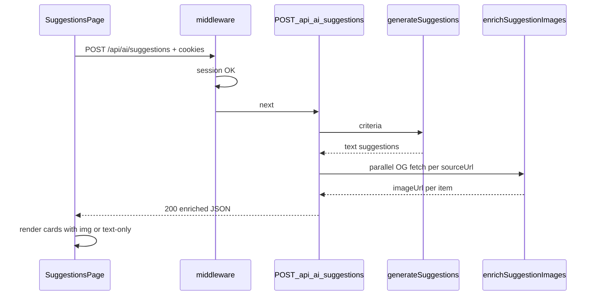

# Plan wdrożenia: AI activity suggestions (S-01)

## Przegląd

Wdrażamy **north star S-01**: zalogowany rodzic podaje kryteria (FR-001), dostaje kilka zwięzłych propozycji AI z **prawdziwym obrazem i linkiem** (FR-002), **bez zapisu do `events`** (transient display). Zgodnie z [frame.md](frame.md): problem to widoczny flow produktowy + kontrakt obrazu transient, nie pipeline F-04 + DB.

**Decyzje podjęte** (frame + planowanie):

| Decyzja          | Wybór                                                              | Uzasadnienie                                              | Źródło       |
| ---------------- | ------------------------------------------------------------------ | --------------------------------------------------------- | ------------ |
| Persist          | **Transient only** — brak INSERT do `events`                       | S-02 przejmuje triage i persist                           | Frame        |
| FR-002 bar       | **Prawdziwy obraz** z `sourceUrl` (OG), nie placeholder            | Wymaganie użytkownika przy frame                          | Frame        |
| Strategia obrazu | **Server-side OG enricher** po `generateSuggestions`               | Bez halucynacji modelu; wykorzystuje `sourceUrl` z F-02   | Plan         |
| Pole obrazu      | `imageUrl?` w **warstwie API** (nie w schemacie OpenRouter)        | Rozdzielenie AI text vs enricher                          | Plan         |
| Fallback obrazu  | Karta **bez bloku obrazu** (tekst + link zostają)                  | Brak fałszywego placeholdera; FR-002: „co najwyżej jeden” | Plan         |
| Transport UI     | `fetch` JSON + `credentials: "include"`                            | Istniejące API; nie wzorzec form POST auth                | Research     |
| API auth UX      | **JSON 401** dla `POST /api/*` bez sesji                           | `fetch` nie parsuje 302 HTML                              | Plan         |
| Nawigacja        | Link **Propozycje** w Topbar; post-login bez zmiany (`/dashboard`) | Minimalna zmiana flow auth                                | Plan         |
| Streaming AI     | Nie                                                                | F-02 scope; loading spinner w UI                          | F-02 archive |

## Analiza stanu obecnego

Z [frame.md](frame.md) i [research.md](research.md) — potwierdzone w kodzie:

- **F-02 gotowe:** `POST /api/ai/suggestions` → `{ suggestions: [{ title, summary, sourceUrl? }] }` (`src/pages/api/ai/suggestions.ts`, `src/lib/ai/*`).
- **F-03 gotowe:** `/suggestions` będzie auto-chronione (`src/lib/route-access.ts`).
- **Brak produktu:** zero `fetch` do API w `src/`; tylko `dashboard.astro` placeholder.
- **Brak obrazów:** `suggestion-response.schema.ts` bez `imageUrl`; brak enrichera OG.
- **F-04 nie na ścieżce S-01:** `uploadEventImage` wymaga `Blob` + `event_id` — nie dla transient display z linków AI.
- **Brak test runnera** — weryfikacja: lint/build + manual.

### Kluczowe odkrycia

- API i middleware wystarczają na happy path; główny brak to **strona + komponenty React**.
- Obraz transient = **hotlink do zewnętrznego OG URL** w `` (bez bucketa, bez signed URL).
- OpenRouter ~25s timeout (`openrouter-client.ts`) — UI musi pokazać loading przez cały czas (AI + enricher).

## Pożądany stan końcowy

1. Zalogowany rodzic otwiera `/suggestions`, wypełnia formularz (miejsce, czas, wiek, indoor/outdoor).
2. Po submit: loading → `POST /api/ai/suggestions` → 1–5 kart z tytułem, podsumowaniem, linkiem do źródła.
3. Karty z działającym `sourceUrl` i OG meta pokazują **prawdziwy obraz**; przy braku OG — karta tekstowa (bez fałszywego placeholdera).
4. Brak zapisu do Supabase `events`; brak triage (S-02).
5. `npm run lint` + `npm run build` przechodzą; manual smoke z sesją + OpenRouter env.

## Czego NIE robimy

- INSERT/UPDATE `events`, `uploadEventImage`, signed URL bucketa (S-02 / S-03 / S-05).
- Triage accept/reject/maybe (S-02), publikacja (S-05), biblioteka CRUD (S-04).
- Rozszerzenie schematu OpenRouter o `imageUrl` (halucynacje).
- Streaming SSE, nowy model env, anon AI.
- Test runner (brak w projekcie).
- Zmiana post-login redirect na `/suggestions` (tylko link w Topbar).

## Podejście do implementacji

Warstwy: **Astro page** → **React island** → **istniejące API** → **nowy enricher** w `src/lib/suggestions/`.

## Krytyczne szczegóły implementacji

- **Kolejność latencji:** OpenRouter (~do 25s) + do 5 równoległych OG fetchów — UI loading musi obejmować **cały** request API; nie osobny fetch obrazów z przeglądarki.
- **OG fetch na Workerze:** `fetch(sourceUrl)` z krótkim timeoutem per URL (~8s) i `Promise.allSettled` — jeden nieudany OG nie blokuje pozostałych kart.
- **Hotlink:** `` do zewnętrznego hosta — część stron blokuje hotlink; akceptowalne ograniczenie MVP (karta bez obrazu).

---

## Faza 1: Strona produktowa i formularz kryteriów

### Przegląd

Chroniona strona `/suggestions`, React island z formularzem, walidacją client-side i wywołaniem API. Wyniki jako karty tekst + link (bez obrazów — tymczasowo). Loading i obsługa błędów API.

### Wymagane zmiany

#### 1. Strona Astro

**Plik:** `src/pages/suggestions.astro`

**Cel:** Nowa strona produktowa w shellu jak `dashboard.astro` — `Layout` → `AppShell showTopbar` → `PanelCard` + island.

**Kontrakt:** Tytuł strony po polsku (np. „Propozycje — kids-time”); import `SuggestionsPage` z `client:load`.

#### 2. React island — formularz + wyniki (tekst)

**Plik:** `src/components/suggestions/SuggestionsPage.tsx`

**Cel:** Jeden island: stan formularza, `fetch` POST, lista wyników, loading/error. Reuse `FormField`, `ServerError`, `Button`, `cn()`.

**Kontrakt:**

- Pola: `place`, `time` (string), `childAge` (number 0–18), `indoorOutdoor` (`indoor` | `outdoor` | `either`) — mirror `suggestionRequestSchema`.
- `childAge` w stanie formularza jako **string** (ograniczenie `FormField`); przed `fetch` parsuj do `number` (`Number` / `parseInt`) i waliduj zakres 0–18 — inaczej API zwróci 400.
- `indoorOutdoor`: natywny `<select>` (brak shadcn select w repo).
- Submit: `fetch("/api/ai/suggestions", { method: "POST", headers: { "Content-Type": "application/json" }, credentials: "include", body })`.
- Mapowanie błędów: 400 validation, 502/503/504, 401 → komunikat PL.
- Wyniki: lista kart z `title`, `summary`, opcjonalny link `sourceUrl` (otwiera w nowej karcie).
- Loading: disabled submit + tekst „Szukam propozycji…” (wzorzec `SubmitButton` pending).

#### 3. Komponent karty (tekst)

**Plik:** `src/components/suggestions/SuggestionCard.tsx`

**Cel:** Prezentacja pojedynczej propozycji; w Fazie 1 bez sekcji obrazu (props przygotowane pod `imageUrl?` w Fazie 2).

**Kontrakt:** Props: `title`, `summary`, `sourceUrl?`, `imageUrl?` (ignorowane w F1).

#### 4. Nawigacja

**Plik:** `src/components/Topbar.astro`

**Cel:** Link „Propozycje” → `/suggestions` obok „Panel”.

**Kontrakt:** Ten sam styl co link Panel (`Topbar.astro:13-17`).

#### 5. Middleware — JSON 401 dla API

**Plik:** `src/middleware.ts`

**Cel:** Niezalogowany request do `/api/` (poza `/api/auth`) → `401` JSON zamiast 302 HTML, zanim UI zacznie `fetch`ować API.

**Kontrakt:** Przed redirect: jeśli `pathname.startsWith("/api/")` && !`pathname.startsWith("/api/auth")` → `Response` 401 `{ error: "unauthorized" }`. Strony HTML nadal 302.

### Kryteria sukcesu

#### Weryfikacja automatyczna

- `npx astro sync` + `npm run lint` + `npm run build` przechodzą.

#### Weryfikacja ręczna

- Zalogowany użytkownik: `/suggestions` renderuje formularz.
- Submit z poprawnymi danymi + OpenRouter env: 1–5 kart z tytułem, podsumowaniem, linkiem.
- Loading widoczny podczas oczekiwania na API.
- Błąd walidacji (puste pole) — inline, bez requestu.
- Niezalogowany GET `/suggestions` → redirect `/auth/signin`.
- `fetch` API bez cookies → 401 JSON (nie HTML).

**Uwaga implementacyjna:** Po Fazie 1 zatrzymaj się na ręczne potwierdzenie przed Fazą 2.

---

## Faza 2: Enricher obrazów OG i wyświetlanie FR-002

### Przegląd

Server-side pobranie `og:image` / `twitter:image` z `sourceUrl`, rozszerzenie odpowiedzi API o `imageUrl`, wyświetlenie obrazu na kartach.

### Wymagane zmiany

#### 1. Schemat odpowiedzi wzbogaconej

**Plik:** `src/lib/suggestions/enriched-response.schema.ts`

**Cel:** Zod schema dla odpowiedzi API po enricherze — bazuje na `suggestionItemSchema` + opcjonalne `imageUrl` (URL https).

**Kontrakt:** `enrichedSuggestionItemSchema` = item + `imageUrl?: string` (URL refine). `enrichedSuggestionResponseSchema` = `{ suggestions: enrichedItem[] }`.

#### 2. Enricher OG

**Plik:** `src/lib/suggestions/enrich-suggestion-images.ts`

**Cel:** Dla każdej propozycji z `sourceUrl` — fetch HTML, wyciągnij OG image, zwróć `imageUrl` lub `undefined`.

**Kontrakt:**

- `enrichSuggestionImages(items: SuggestionItem[]): Promise<EnrichedSuggestionItem[]>`
- Per-URL timeout ~8s (`AbortSignal.timeout`); równolegle `Promise.allSettled`.
- Parser: `og:image`, `twitter:image` z meta tagów; resolve względnych URL do absolutnych.
- **Regex-only** na fragmencie HTML (bez DOM parsera); pobierz co najwyżej **pierwsze 256 KB** odpowiedzi (`Content-Length` / early abort po limicie).
- Tylko `https:` w wyniku; błąd fetch/parse → `imageUrl` undefined (bez throw całego API).
- Stały `User-Agent` w requestach OG (identyfikacja bots).

#### 3. Integracja w API route

**Plik:** `src/pages/api/ai/suggestions.ts`

**Cel:** Po `generateSuggestions` wywołać enricher; zwrócić enriched JSON.

**Kontrakt:** Handler przyjmuje `locals`; po sukcesie AI: `enrichSuggestionImages(result.suggestions)` → `jsonResponse(enriched, 200)`.

#### 4. Eksport typów

**Plik:** `src/types.ts`

**Cel:** Re-export `EnrichedSuggestionResponse` / `EnrichedSuggestionItem` dla UI.

#### 5. Karta z obrazem

**Plik:** `src/components/suggestions/SuggestionCard.tsx`

**Cel:** Gdy `imageUrl` — `` nad treścią (aspect-ratio, `object-cover`, `alt={title}`); gdy brak — layout tekstowy bez pustego placeholdera.

**Kontrakt:** `loading="lazy"`; `onError` ukrywa broken image (hotlink block) — fallback do widoku tekstowego.

#### 6. UI — typ odpowiedzi

**Plik:** `src/components/suggestions/SuggestionsPage.tsx`

**Cel:** Parsowanie odpowiedzi jako `EnrichedSuggestionResponse`; przekazanie `imageUrl` do kart.

### Kryteria sukcesu

#### Weryfikacja automatyczna

- `npm run lint` + `npm run build` przechodzą.

#### Weryfikacja ręczna

- Propozycja z `sourceUrl` wskazującym stronę z OG (np. znana strona instytucji) — **widoczny prawdziwy obraz**.
- Propozycja bez `sourceUrl` lub bez OG — karta tekstowa (bez fałszywego obrazu).
- Cały flow nadal transient (brak wpisów w `events` w Supabase Studio).

---

## Faza 3: Dokumentacja i zamknięcie

### Przegląd

Handler guard (defense in depth), README, opcjonalny smoke script, przygotowanie do `/10x-implement` review. Middleware JSON 401 przeniesiony do Fazy 1.

### Wymagane zmiany

#### 1. Guard w handlerze (defense in depth)

**Plik:** `src/pages/api/ai/suggestions.ts`

**Cel:** Na początku handlera: jeśli `!locals.user` → 401 JSON (gdy middleware kiedykolwiek przepuści).

**Kontrakt:** `export const POST: APIRoute = async ({ request, locals }) => { ... }`.

#### 2. README

**Plik:** `README.md`

**Cel:** Sekcja S-01: `/suggestions`, wymagane env OpenRouter, manual test flow.

#### 3. Smoke script (opcjonalny, zalecany)

**Plik:** `scripts/smoke-suggestions-enriched.ts`

**Cel:** CLI: wywołanie enrichera na przykładowym URL (bez pełnego Astro) — szybka weryfikacja OG parsera.

**Kontrakt:** Nie wymaga auth; testuje tylko `enrichSuggestionImages` na mock items.

### Kryteria sukcesu

#### Weryfikacja automatyczna

- `npx astro sync` + `npm run lint` + `npm run build` (gate CI).

#### Weryfikacja ręczna

- Pełny E2E: sign-in → `/suggestions` → kryteria → karty z obrazem (gdy OG dostępny) + link.
- Topbar: link Propozycje działa.

---

## Strategia testowania

### Testy jednostkowe

- Brak runnera — nie dodawać w S-01.

### Testy integracyjne

- Manual E2E z `.dev.vars` (OpenRouter + Supabase smoke user).

### Kroki testowania ręcznego

1. `npm run dev` + zaloguj się jako smoke user.
2. `/suggestions` — formularz, submit, loading, wyniki.
3. Sprawdź co najmniej jedną kartę z obrazem OG i jedną bez (brak sourceUrl lub brak OG).
4. Wyloguj — `fetch` API w DevTools → 401 JSON.
5. `npm run lint` + `npm run build`.

## Uwagi dotyczące wydajności

- Łączny czas requestu: OpenRouter (do ~25s) + OG (do ~8s × równolegle) — akceptowalne dla MVP; UI musi komunikować długie oczekiwanie.
- Brak cache OG w S-01 — transient; cache może przyjść w późniejszym slice.

## Uwagi dotyczące migracji

- Brak migracji DB i Storage — S-01 nie dotyka Supabase schema.

## Referencje

- [change.md](change.md), [frame.md](frame.md), [research.md](research.md)
- [F-02 archive](../../archive/2026-05-26-ai-suggestion-scaffold/plan.md)
- `src/pages/dashboard.astro` — wzorzec strony produktowej
- `src/components/auth/SignInForm.tsx` — wzorzec walidacji formularza
- `src/pages/api/ai/suggestions.ts` — istniejące API

## Progress

> Konwencja: `- [ ]` oczekujące, `- [x]` wykonane. Dodaj ` — <commit sha>` gdy krok zostanie zrealizowany. Nie zmieniaj nazw tytułów kroków.

### Faza 1: Strona produktowa i formularz kryteriów

#### Automatyczne

- [x] 1.1 `npx astro sync` + `npm run lint` + `npm run build` — 71c6ae4

#### Ręczne

- [x] 1.2 Formularz + karty tekst/link + loading na `/suggestions` (zalogowany user) — 71c6ae4
- [x] 1.3 Walidacja inline (puste pole) — bez requestu do API — 71c6ae4
- [x] 1.4 Niezalogowany GET `/suggestions` → redirect `/auth/signin` — 71c6ae4
- [x] 1.5 Niezalogowany POST API → 401 JSON (nie HTML) — 71c6ae4

### Faza 2: Enricher obrazów OG i wyświetlanie FR-002

#### Automatyczne

- [x] 2.1 `npm run lint` + `npm run build` — 8d57cbd

#### Ręczne

- [x] 2.2 Karta z prawdziwym obrazem OG gdy `sourceUrl` ma meta — 8d57cbd
- [x] 2.3 Brak fałszywego placeholdera przy nieudanym OG — 8d57cbd

### Faza 3: Dokumentacja i zamknięcie

#### Automatyczne

- [x] 3.1 `npx astro sync` + `npm run lint` + `npm run build`

#### Ręczne

- [x] 3.2 E2E north star: kryteria → propozycje z obrazem + link (transient)
- [x] 3.3 Topbar: link Propozycje → `/suggestions` działa
