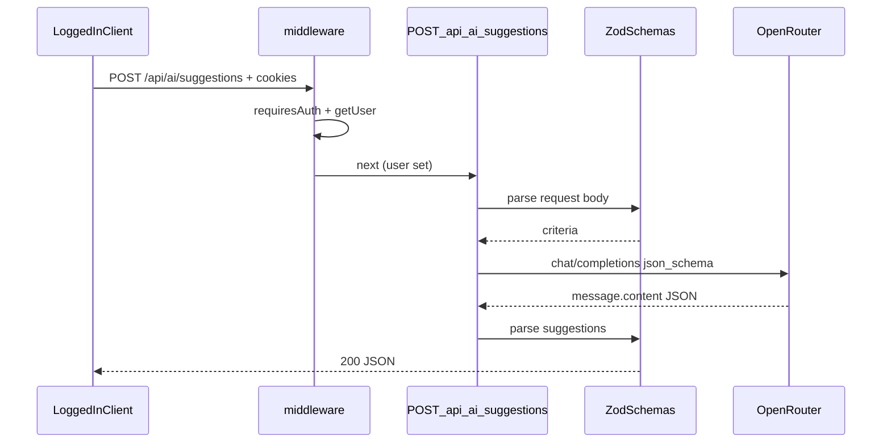

# Plan wdrożenia: AI suggestion scaffold (F-02)

## Przegląd

Wdrażamy serwerową ścieżkę AI zgodną z [change.md](context/changes/ai-suggestion-scaffold/change.md) i [research.md](context/changes/ai-suggestion-scaffold/research.md): rodzic (sesja Supabase) wysyła kryteria FR-001, Worker wywołuje OpenRouter, zwraca zweryfikowany JSON propozycji. Fundament odblokowuje S-01 i S-03.

**Decyzje podjęte** (potwierdzone przez użytkownika 2026-05-26):

| Decyzja    | Wybór                                                                           | Uzasadnienie                                                                                             | Źródło              |
| ---------- | ------------------------------------------------------------------------------- | -------------------------------------------------------------------------------------------------------- | ------------------- |
| Model      | **`openai/gpt-4o-mini`** via `OPENROUTER_MODEL` w env                           | Structured outputs (`json_schema`); ~$0,15/1M in + $0,60/1M out na OpenRouter; zmiana modelu = tylko env | User + Research     |
| Guardrails | max **5** propozycji; Zod: `title` ≤100, `summary` ≤200; prompt prosi o **3–5** | PRD: „a few concise”; elastyczność vs „exactly 3”                                                        | PRD-v2 + Research   |
| Auth       | Wymaga sesji od F-02 (middleware default deny)                                  | Zgodne z F-03 i US-01                                                                                    | Research            |
| Klient AI  | `fetch`, bez SDK                                                                | Edge-friendly, mniej zależności                                                                          | Research (Context7) |
| Streaming  | Nie w F-02                                                                      | Scaffold non-streaming; UX w S-01                                                                        | Research            |

## Analiza stanu obecnego

- **SSR + Cloudflare**: [`astro.config.mjs`](astro.config.mjs) `output: "server"`, adapter `@astrojs/cloudflare`; [`wrangler.jsonc`](wrangler.jsonc) z `nodejs_compat`.
- **API**: tylko [`src/pages/api/auth/*`](src/pages/api/auth/) (form + redirect); brak JSON API domenowego.
- **Auth**: [`src/middleware.ts`](src/middleware.ts) + [`src/lib/route-access.ts`](src/lib/route-access.ts) — `/api/ai/*` **nie** jest publiczne → wymaga `context.locals.user`.
- **Sekrety**: wzorzec `astro:env/server` w [`src/lib/supabase.ts`](src/lib/supabase.ts); status w [`src/lib/config-status.ts`](src/lib/config-status.ts).
- **Zod**: w [`package.json`](package.json) **brak** bezpośredniej zależności `zod` (tylko transitive) — trzeba dodać `zod` do `dependencies`.
- **AI**: brak kodu OpenRouter w `src/`.

### Kluczowe odkrycia

- Czas oczekiwania na `fetch` do OpenRouter **nie** zużywa CPU Workera; i tak ustawić `AbortSignal.timeout(~25s)` (Research §3).
- Niezalogowany `POST /api/ai/*` dostanie **302 → /auth/signin** (HTML), nie JSON 401 — akceptowalne dla F-02; S-01 użyje `fetch` same-origin z cookies lub osobnej poprawki middleware.
- NFR-03 nie jest zdefiniowany w [`context/foundation/prd.md`](context/foundation/prd.md) — guardrails realizujemy przez `json_schema` + Zod + prompt (jakość/zwięzłość).

## Pożądany stan końcowy

1. Dev z `OPENROUTER_API_KEY`, `OPENROUTER_MODEL` w `.dev.vars` + Supabase session może wywołać:
   `POST /api/ai/suggestions` z JSON `{ place, time, childAge, indoorOutdoor }`.
2. Odpowiedź `200` z `{ suggestions: [{ title, summary, sourceUrl? }, ...] }` (1–5 elementów).
3. Brak klucza OpenRouter → `503` z bezpiecznym komunikatem (bez wycieku secretu).
4. Błąd/timeout upstream → `502` / `504`.
5. `npm run build` i `npm run lint` przechodzą po `npx astro sync`.

## Czego NIE robimy

- UI formularza kryteriów, triage, zapis propozycji do Supabase (S-01, S-02).
- Obrazy w propozycjach (F-04 / FR-002).
- Streaming SSE, Response Healing plugin, batch bez sesji / `service_role`.
- Zmiana allowlisty auth (anon AI).
- Test runner (brak w projekcie) — tylko weryfikacja manualna + CI lint/build.

## Podejście do implementacji

Warstwy: **env + config-status** → **`src/lib/ai/*`** (schemas, prompt, client) → **route** → **dokumentacja / smoke**.

## Krytyczne szczegóły implementacji

- **Auth na API**: middleware redirectuje niezalogowanych — test manualny wymaga cookie sesji (DevTools po sign-in), nie samego `curl` bez `-b`.
- **Kolejność**: najpierw `npm install zod` + `astro.config` env + `npx astro sync`, dopiero potem importy `astro:env` w nowych plikach.
- **OpenRouter**: `provider: { require_parameters: true }` opcjonalnie w request body, jeśli model wspiera — zmniejsza cichy fallback bez `json_schema`.

---

## Phase 0: Wybór i weryfikacja modelu (pre-code) — **done**

### Przegląd

Decyzja operacyjna przed kodowaniem klienta — **zamknięta**: `OPENROUTER_MODEL=openai/gpt-4o-mini` ([karta modelu](https://openrouter.ai/models/openai/gpt-4o-mini)).

### Wymagane zmiany

#### 1. Dokumentacja wyboru modelu

**Plik**: [context/changes/ai-suggestion-scaffold/change.md](context/changes/ai-suggestion-scaffold/change.md)

**Cel**: Zamknąć roadmap open question #2 — wpisać wybrany `OPENROUTER_MODEL` i datę weryfikacji na [openrouter.ai/models](https://openrouter.ai/models) (flaga structured outputs / `response_format`).

**Kontrakt**: Pole w `## Notes`: `OPENROUTER_MODEL=<id>` + link do strony modelu.

### Kryteria sukcesu

#### Weryfikacja automatyczna

- (brak — faza dokumentacyjna)

#### Weryfikacja ręczna

- Model na OpenRouter obsługuje `json_schema` strict (screenshot lub notatka w change.md).

---

## Phase 1: Zależności, sekrety i status konfiguracji

### Przegląd

Przygotowanie środowiska zgodnego z Supabase: `astro:env`, `.dev.vars`, config dashboard.

### Wymagane zmiany

#### 1. Zod jako zależność produkcyjna

**Plik**: [package.json](package.json)

**Cel**: Spełnić konwencję repo (walidacja na granicy API).

**Kontrakt**: `"zod": "^4.x"` w `dependencies` (wersja zgodna z lockfile po `npm install`).

#### 2. Schema env OpenRouter

**Plik**: [astro.config.mjs](astro.config.mjs)

**Cel**: Server-only secrets i model identyczny lokalnie / na Workerze.

**Kontrakt**:

- `OPENROUTER_API_KEY`: `context: "server"`, `access: "secret"`, `optional: true` (jak Supabase — graceful 503 gdy brak).
- `OPENROUTER_MODEL`: `context: "server"`, `access: "secret"` lub public server string, `optional: true` — brak → 503 z komunikatem konfiguracyjnym.

#### 3. Przykładowe zmienne

**Pliki**: [.env.example](.env.example), [README.md](README.md) (sekcja Supabase/env)

**Cel**: Dev onboarding bez zgadywania nazw.

**Kontrakt**: Komentarze + `OPENROUTER_API_KEY=`, **`OPENROUTER_MODEL=openai/gpt-4o-mini`** (wartość kanoniczna F-02); instrukcja `npx wrangler secret put OPENROUTER_API_KEY` i `OPENROUTER_MODEL` (jak Supabase). Opcjonalnie: limit kredytów na kluczu w [openrouter.ai/settings/keys](https://openrouter.ai/settings/keys) (projekt szkoleniowy).

#### 4. Config status UI

**Plik**: [src/lib/config-status.ts](src/lib/config-status.ts)

**Cel**: Spójny UX „brak konfiguracji” jak Supabase.

**Kontrakt**: Nowy wpis `OpenRouter` z `configured: Boolean(OPENROUTER_API_KEY && OPENROUTER_MODEL)` (lub tylko key jeśli model ma sensowny fallback dokumentowany w README — preferowane: oba wymagane).

### Kryteria sukcesu

#### Weryfikacja automatyczna

- `npm ci` / `npm install` bez błędów
- `npx astro sync`
- `npm run lint`
- `npm run build` (z istniejącymi Supabase env w CI)

#### Weryfikacja ręczna

- `.dev.vars` zawiera nowe klucze obok Supabase; strona z config banner pokazuje OpenRouter jako skonfigurowany/nie.

---

## Phase 2: Moduł domenowy AI (`src/lib/ai/`)

### Przegląd

Schematy Zod, budowa promptu, klient OpenRouter z timeoutem i mapowaniem błędów.

### Wymagane zmiany

#### 1. Schemat request (FR-001)

**Plik**: `src/lib/ai/suggestion-request.schema.ts` (nowy)

**Cel**: Jedno źródło prawdy dla body API i przyszłego S-01.

**Kontrakt**:

- `place`: `z.string().trim().min(1).max(200)`
- `time`: `z.string().trim().min(1).max(200)` (np. „sobota popołudnie”, „jutro 15:00”)
- `childAge`: `z.number().int().min(0).max(18)`
- `indoorOutdoor`: `z.enum(["indoor", "outdoor", "either"])`
- Export: `SuggestionRequest`, `suggestionRequestSchema`

#### 2. Schemat response + JSON Schema dla OpenRouter

**Plik**: `src/lib/ai/suggestion-response.schema.ts` (nowy)

**Cel**: Walidacja po parsowaniu `message.content`; guardrails NFR-03.

**Kontrakt**:

- `suggestionItemSchema`: `title` max 100, `summary` max 200, `sourceUrl` optional URL lub pusty → omit
- `suggestions`: array `.min(1).max(5)`
- Export: `SuggestionResponse`, `openRouterJsonSchema` (obiekt pod `response_format.json_schema` z `strict: true`, `additionalProperties: false`) — nazwa np. `activity_suggestions`

#### 3. Prompt builder

**Plik**: `src/lib/ai/build-suggestion-prompt.ts` (nowy)

**Cel**: Mapowanie kryteriów na `messages` (system + user), język polski dla rodzica PL, instrukcja: 3–5 propozycji, zwięzłe, dopasowane do wieku/miejsca/czasu/indoor.

**Kontrakt**: Funkcja `(criteria: SuggestionRequest) => { messages: OpenRouterMessage[] }` bez logowania treści w produkcji.

#### 4. Klient OpenRouter

**Plik**: `src/lib/ai/openrouter-client.ts` (nowy)

**Cel**: Izolacja `fetch`, timeout, parsowanie odpowiedzi.

**Kontrakt**:

- Import `OPENROUTER_API_KEY`, `OPENROUTER_MODEL` z `astro:env/server`
- `POST https://openrouter.ai/api/v1/chat/completions`
- Headers: `Authorization: Bearer …`, `Content-Type: application/json` (opcjonalnie `HTTP-Referer` / `X-Title` dla OpenRouter analytics — stałe z nazwy projektu)
- Body: `model`, `messages`, `response_format` z Fazy 2.2, `temperature` niskie (np. 0.3)
- `fetch(..., { signal: AbortSignal.timeout(25_000) })`
- Zwraca `Result<SuggestionResponse, OpenRouterError>` lub rzuca typowane błędy mapowane w route (timeout → 504, HTTP≠2xx → 502, invalid JSON → 502)
- **Nie** logować `apiKey`, pełnego promptu ani `message.content` w prod (`console` tylko status/latency jeśli potrzebne — `no-console` warn)

#### 5. Typy współdzielone (opcjonalnie)

**Plik**: [src/types.ts](src/types.ts)

**Cel**: Re-export typów API dla przyszłych komponentów React.

**Kontrakt**: `export type { SuggestionRequest, SuggestionResponse } from "@/lib/ai/..."`

### Kryteria sukcesu

#### Weryfikacja automatyczna

- `npm run lint`
- `npm run build`

#### Weryfikacja ręczna

- (opcjonalnie) krótki skrypt Node/tsx wywołujący `openrouter-client` z `.dev.vars` — tylko jeśli implementator chce; nie wymagane w CI

---

## Phase 3: Endpoint API

### Przegląd

`POST /api/ai/suggestions` — JSON in/out, błędy HTTP, bez `prerender` (SSR domyślny).

### Wymagane zmiany

#### 1. Route handler

**Plik**: `src/pages/api/ai/suggestions.ts` (nowy)

**Cel**: Publiczny kontrakt F-02 dla S-01.

**Kontrakt**:

- `export const POST: APIRoute`
- `Content-Type` musi zawierać `application/json`; inaczej `400`
- `request.json()` opakować w `try/catch`:
  - malformed JSON → `400` `{ error: "invalid_json" }`
  - poprawny JSON → `suggestionRequestSchema.safeParse` → `400` `{ error: "validation", issues }` (bez stack trace)
- Jeśli brak `OPENROUTER_API_KEY` lub `OPENROUTER_MODEL` → `503` `{ error: "configuration", message }`
- Wywołanie `generateSuggestions(criteria)` z lib
- Sukces: `200` + `Content-Type: application/json` + body `SuggestionResponse`
- Błędy upstream według mapowania z Fazy 2.4
- **Nie** sprawdzać `context.locals.user` w route (middleware już chroni) — opcjonalnie assert `locals.user` dla jawności

#### 2. (Opcjonalnie) `wrangler.jsonc` limits

**Plik**: [wrangler.jsonc](wrangler.jsonc)

**Cel**: Zapas na parsowanie JSON po długim fetch (Research).

**Kontrakt**: `"limits": { "cpu_ms": 30000 }` — tylko jeśli smoke na preview pokaże problem; domyślnie pominąć w pierwszym PR.

### Kryteria sukcesu

#### Weryfikacja automatyczna

- `npx astro sync && npm run lint && npm run build`

#### Weryfikacja ręczna

- Zalogowany użytkownik: DevTools → `fetch("/api/ai/suggestions", { method: "POST", headers: { "Content-Type": "application/json" }, body: JSON.stringify({ place: "Kraków", time: "niedziela popołudnie", childAge: 6, indoorOutdoor: "outdoor" }), credentials: "include" })` → `200` i sensowna tablica `suggestions`
- Niezalogowany: ten sam fetch → redirect/sign-in (oczekiwane)
- Celowo zły body → `400`
- Usunięty `OPENROUTER_API_KEY` z `.dev.vars` → `503`

**Uwaga**: Po zakończeniu fazy — ręczne potwierdzenie przed zamknięciem F-02 / archive.

---

## Phase 4: Zamknięcie zmiany i roadmapy

### Przegląd

Aktualizacja artefaktów i statusu F-02.

### Wymagane zmiany

#### 1. Status change i roadmap

**Pliki**: [context/changes/ai-suggestion-scaffold/change.md](context/changes/ai-suggestion-scaffold/change.md), [context/foundation/roadmap.md](context/foundation/roadmap.md)

**Cel**: Odzwierciedlić ukończenie fundamentu.

**Kontrakt**: `change.md` → `status: implemented` (przy archive: `archived`); wiersz F-02 w roadmap → `done` po `/10x-archive`.

#### 2. Plan-brief (przy zapisie pełnego planu)

**Plik**: `context/changes/ai-suggestion-scaffold/plan-brief.md`

**Cel**: 2-minutowy przegląd dla reviewera (szablon z skill 10x-plan).

### Kryteria sukcesu

#### Weryfikacja automatyczna

- CI gate jak w [AGENTS.md](AGENTS.md): `npm ci`, `npx astro sync`, `npm run lint`, `npm run build`

#### Weryfikacja ręczna

- Ustawiony i zweryfikowany limit kredytów/budżetu dla klucza OpenRouter w UI (release gate przed smoke na preview/production)
- Smoke na preview/deploy Worker z `wrangler secret put` dla OpenRouter
- Roadmap F-02 oznaczony done po archive

---

## Strategia testowania

### Testy jednostkowe

- Brak runnera — **nie dodawać** w F-02 bez osobnej decyzji projektu.

### Testy integracyjne

- Manualny flow: sign-in → POST suggestions → walidacja kształtu JSON.

### Kroki testowania ręcznego

1. Ustaw `OPENROUTER_API_KEY`, `OPENROUTER_MODEL` w `.dev.vars`.
2. `npm run dev`, zaloguj się jako rodzic.
3. Wywołaj endpoint z kryteriami (fetch powyżej).
4. Sprawdź: 3–5 propozycji, krótkie `summary`, opcjonalny `sourceUrl`.
5. Symuluj timeout (np. bardzo krótki timeout w dev-only flag) lub invalid key → 502/504 bez treści secretu w body.

## Uwagi dotyczące wydajności

- Jeden subrequest OpenRouter na wywołanie — OK na Workers.
- Latencja dominuje czas wall-clock; UI w S-01 powinien pokazać loading (poza F-02).

## Uwagi dotyczące migracji

- Brak migracji DB.
- Produkcja: dodać secrets w Cloudflare przed pierwszym deployem z tą trasą ([context/deployment/deploy-plan.md](context/deployment/deploy-plan.md) — zaktualizować wiersz OpenRouter gdy F-02 merge).

## Referencje

- [research.md](context/changes/ai-suggestion-scaffold/research.md)
- [change.md](context/changes/ai-suggestion-scaffold/change.md)
- [infrastructure.md](context/foundation/infrastructure.md) — ryzyka CPU/timeout
- Wzorce: [`src/lib/supabase.ts`](src/lib/supabase.ts), [`src/middleware.ts`](src/middleware.ts)

## Progress

### Phase 0: Wybór i weryfikacja modelu (pre-code) — **done**

#### Ręczne

- [x] 0.1 Model OpenRouter zweryfikowany (structured outputs) i zapisany w change.md

### Phase 1: Zależności, sekrety i status konfiguracji

#### Automatyczne

- [x] 1.1 `npm install` + `npx astro sync` + `npm run lint` + `npm run build` — a909e37

#### Ręczne

- [x] 1.2 `.dev.vars` i config-status pokazują poprawny stan OpenRouter — a909e37

### Phase 2: Moduł domenowy AI (`src/lib/ai/`)

#### Automatyczne

- [x] 2.1 `npm run lint` + `npm run build`

### Phase 3: Endpoint API

#### Automatyczne

- [ ] 3.1 `npm run lint` + `npm run build`

#### Ręczne

- [ ] 3.2 Zalogowany POST zwraca 200 i poprawny JSON propozycji
- [ ] 3.3 Walidacja 400 i brak konfiguracji 503 zweryfikowane

### Phase 4: Zamknięcie zmiany i roadmapy

#### Automatyczne

- [ ] 4.1 CI gate (lint + build) na branchu

#### Ręczne

- [ ] 4.2 Smoke na preview/deploy z Worker secrets
- [ ] 4.3 `/10x-archive ai-suggestion-scaffold` + F-02 done w roadmap
