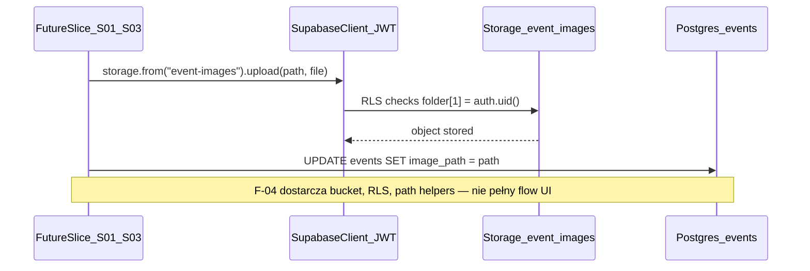

# Plan wdrożenia: Event image storage (F-04)

## Przegląd

Wdrażamy fundament Supabase Storage zgodny z [change.md](context/changes/event-image-storage/change.md): prywatny bucket `event-images`, polityki RLS na `storage.objects` (właściciel = pierwszy segment ścieżki), konwencja `{owner_id}/{event_id}/{filename}` zapisywana w `events.image_path`, oraz helpery w `src/lib/storage/*` pod direct upload z klienta Supabase (JWT). Odblokowuje S-01 (obraz w propozycji AI) i S-03 (ręczne wydarzenie z obrazem).

**Decyzje podjęte** (potwierdzone przez użytkownika 2026-06-22):

| Decyzja          | Wybór                                                          | Uzasadnienie                                                                | Źródło |
| ---------------- | -------------------------------------------------------------- | --------------------------------------------------------------------------- | ------ |
| Dostęp bucketu   | **Private** + RLS owner-only                                   | Spójne z F-01; brak wycieku draftów                                         | Plan   |
| Ścieżka          | **`{owner_id}/{event_id}/{filename}`**                         | Lustrzane z modelem właściciela `events`; proste polityki `(foldername)[1]` | Plan   |
| Published read   | **Odłożone do S-05**                                           | FR-006 / public visibility poza zakresem F-04                               | Plan   |
| Upload           | **Direct client** (`supabase.storage`) + helpery path/validate | Standard Supabase; bez proxy multipart na Workerze                          | Plan   |
| Limity           | **max 5 MB**; **JPEG, PNG, WebP**                              | FR-002/003: jeden obraz aktywności; rozsądny MVP                            | Plan   |
| Deliverable F-04 | **Migracja + polityki + lib + README + smoke script**          | Scaffold bez UI/API produktowego                                            | Plan   |
| Replace          | **Jeden obraz / event — nadpisanie**                           | PRD: at most one image; helper usuwa stary object przy replace              | Plan   |

## Analiza stanu obecnego

- **DB (F-01)**: [`supabase/migrations/20260526120000_events_schema_and_rls.sql`](supabase/migrations/20260526120000_events_schema_and_rls.sql) — kolumna `image_path text` nullable; RLS na `public.events` (owner + published SELECT).
- **Storage**: brak migracji bucketu; [`supabase/config.toml`](supabase/config.toml) ma `[storage] enabled = true`, szablon bucketu **zakomentowany** (linie 114–119).
- **App**: [`src/lib/supabase.ts`](src/lib/supabase.ts) — cookie SSR client; **brak** `supabase.storage` w kodzie.
- **Typy**: [`src/types/database.generated.ts`](src/types/database.generated.ts) — `image_path` na `events`; brak typów schema `storage`.
- **Auth**: middleware F-03 — sesja JWT rodzica; bez `service_role` w slice'ach foundation.

### Kluczowe odkrycia

- F-01 **atomowo** łączy schemat + RLS w jednej migracji — F-04 powinien **bucket + polityki storage** wdrożyć w **jednym** pliku SQL (bez okna „bucket bez RLS”).
- Polityki `storage.objects` mogą użyć `(storage.foldername(name))[1] = auth.uid()::text` — pierwszy segment = `owner_id`.
- Odczyt obrazów opublikowanych wydarzeń przez innych rodziców wymaga osobnej polityki (join z `events.is_published`) — **S-05**, nie F-04.
- CI **nie** uruchamia migracji — `database.generated.ts` commitowany ręcznie po `db reset`; smoke lokalny wymaga `npx supabase start`.

## Pożądany stan końcowy

1. Po `npx supabase db reset`: bucket `event-images` (private, 5 MB, MIME jpeg/png/webp) + polityki SELECT/INSERT/UPDATE/DELETE dla właściciela ścieżki.
2. Helpery: `buildEventImagePath`, walidacja MIME/rozszerzenia, `removeEventImage`, `replaceEventImage` (usuń stary + upload nowy path).
3. `events.image_path` przechowuje klucz względem bucketu, np. `{owner_id}/{event_id}/photo.jpg`.
4. Zalogowany rodzic (User A) może upload/read/delete w `{A}/{event_id}/*`; User B **nie** może.
5. README opisuje bucket, ścieżkę, limity i smoke; `npm run lint` + `npm run build` przechodzą.

## Czego NIE robimy

- UI uploadu, formularze S-01/S-03, triage, zapis `events` z obrazem (slice'y produktowe).
- Public bucket ani anon read opublikowanych obrazów (S-05 / FR-006).
- Route API `POST /api/events/.../image` (direct client upload wystarczy na scaffold).
- `service_role` w aplikacji; transformacje obrazów Supabase Pro.
- Test runner — tylko smoke script + weryfikacja manualna.

## Podejście do implementacji

Warstwy: **migracja SQL (bucket + RLS)** → **`src/lib/storage/*`** → **config/README/smoke** → **archive**.

## Krytyczne szczegóły implementacji

- **Kolejność**: migracja SQL → `db reset` → ewentualnie `gen types` (jeśli schema public się zmieni — F-04 może nie wymagać zmiany generated types) → helpery → dokumentacja.
- **Cloud deploy**: jeden `supabase db push` z pełną migracją atomową — **zakaz** push samego bucketu bez polityk.
- **Test RLS storage**: jako `authenticated` (JWT), nie `service_role` — analogicznie do F-01 scenariuszy 1–8.
- **Replace**: przed uploadem nowego pliku helper usuwa wszystkie obiekty pod `{owner_id}/{event_id}/` (`list` + `remove`); jeśli znany stary `image_path`, remove go jawnie przed list (idempotentnie).

---

## Phase 1: Migracja Storage (bucket + RLS)

### Przegląd

Jeden plik migracji tworzący bucket i polityki `storage.objects` — atomowo, wzorzec F-01.

### Wymagane zmiany

#### 1. Migracja bucket + polityki

**Plik**: `supabase/migrations/YYYYMMDDHHmmss_event_images_storage.sql` (nowy)

**Cel**: Private bucket `event-images` z limitami i RLS owner-only.

**Kontrakt**:

- `INSERT INTO storage.buckets`: `id = 'event-images'`, `public = false`, `file_size_limit = 5242880` (5 MB), `allowed_mime_types = ARRAY['image/jpeg','image/png','image/webp']`.
- Polityki na `storage.objects` dla roli `authenticated`:
  - **SELECT / INSERT / UPDATE / DELETE**: `bucket_id = 'event-images' AND (storage.foldername(name))[1] = auth.uid()::text`.
- Brak polityk anon; brak SELECT dla cudzych folderów (published read → S-05).
- Komentarz SQL: `image_path` w `events` = klucz w bucketcie (bez prefiksu bucket id); RLS storage weryfikuje tylko segment właściciela `(foldername)[1]` — walidacja `event_id` ↔ `events.id` należy do warstwy aplikacji (S-01/S-03), nie tej migracji.

#### 2. Lokalny config.toml (parity)

**Plik**: [`supabase/config.toml`](supabase/config.toml)

**Cel**: Lokalny dev odzwierciedla bucket produkcyjny.

**Kontrakt**: Odkomentować / dodać `[storage.buckets.event-images]` z `public = false`, `file_size_limit = "5MiB"`, `allowed_mime_types = ["image/jpeg", "image/png", "image/webp"]`.

### Kryteria sukcesu

#### Weryfikacja automatyczna

- `npx supabase db reset` kończy bez błędów (Docker + `supabase start`)

#### Weryfikacja ręczna

- W Studio / SQL: bucket `event-images` istnieje, `public = false`.
- User A uploaduje do `{A}/{event_id}/test.jpg` — sukces; User B na `{A}/...` — odmowa.
- User A odczytuje własny object — sukces; User B SELECT na cudzy folder — brak dostępu.

**Uwaga**: Po zakończeniu fazy — ręczne potwierdzenie przed Phase 2.

---

## Phase 2: Moduł lib (`src/lib/storage/`)

### Przegląd

Konwencja ścieżki, walidacja pliku, operacje upload/remove/replace na kliencie Supabase (JWT).

### Wymagane zmiany

#### 1. Stałe bucketu

**Plik**: `src/lib/storage/constants.ts` (nowy)

**Cel**: Jedno źródło prawdy dla nazwy bucketu i limitów.

**Kontrakt**: Export `EVENT_IMAGES_BUCKET = 'event-images'`, `EVENT_IMAGE_MAX_BYTES = 5 * 1024 * 1024`, `EVENT_IMAGE_ALLOWED_MIME_TYPES` (jpeg/png/webp).

#### 2. Budowa i walidacja ścieżki

**Plik**: `src/lib/storage/event-image-path.ts` (nowy)

**Cel**: Spójna konwencja `{owner_id}/{event_id}/{filename}` i walidacja wejścia.

**Kontrakt**:

- `buildEventImagePath({ ownerId, eventId, filename })` → string; sanityzacja `filename` (basename, bez `..`, slug/bezpieczne znaki).
- `parseEventImagePath(path)` → `{ ownerId, eventId, filename } | null`.
- `assertOwnerPath(path, ownerId)` — rzuca lub zwraca false gdy segment 1 ≠ owner.
- Walidacja rozszerzenia vs MIME allowlist.

#### 3. Operacje Storage

**Plik**: `src/lib/storage/event-image.ts` (nowy)

**Cel**: Wrap `supabase.storage.from(EVENT_IMAGES_BUCKET)` dla upload/remove/replace.

**Kontrakt**:

- Przyjmuje `SupabaseClient` (z sesją użytkownika) — **nie** tworzy własnego klienta service role.
- `uploadEventImage(client, { ownerId, eventId, file, filename? })` — walidacja rozmiaru/MIME, path przez helper, `upload` z `upsert: true`.
- `removeEventImage(client, imagePath)` — assert owner segment, `remove([path])`.
- `replaceEventImage(client, params)` — zawsze `list` + `remove` wszystkich obiektów pod `{ownerId}/{eventId}/` przed uploadem (gdy brak starych plików — no-op); jeśli podany stary `imagePath`, remove go jawnie (idempotentnie).
- Błędy mapowane na proste typy/komunikaty (bez wycieku wewnętrznych ścieżek Supabase).

#### 4. Re-export typów (opcjonalnie)

**Plik**: [`src/types.ts`](src/types.ts)

**Kontrakt**: Export typów/parametrów helperów jeśli używane przez przyszłe slice'y.

### Kryteria sukcesu

#### Weryfikacja automatyczna

- `npm run lint`
- `npm run build`

#### Weryfikacja ręczna

- (opcjonalnie) krótki unit-less smoke: import helperów, `buildEventImagePath` dla przykładowych UUID zwraca oczekiwany kształt.

---

## Phase 3: Dev onboarding i smoke

### Przegląd

README, smoke script, notatka cloud push — bez UI produktowego.

### Wymagane zmiany

#### 1. README — sekcja Storage

**Plik**: [`README.md`](README.md)

**Cel**: Dev onboarding: bucket, ścieżka, limity, `db reset`, smoke.

**Kontrakt**: Podsekcja przy „Database migrations”: opis `event-images`, konwencja path, 5 MB / MIME, link do smoke script, przypomnienie `supabase db push` na cloud po merge; notatka: RLS storage = owner segment only — upload do `{owner_id}/{event_id}/` wymaga istniejącego `events.id` po stronie aplikacji (S-01/S-03).

#### 2. Smoke script (opcjonalny, zalecany)

**Plik**: `scripts/smoke-event-image.ts` (nowy)

**Cel**: Manualny dowód upload/read/delete z `.env` / `.dev.vars` + JWT test user.

**Kontrakt**: Ładuje `.dev.vars` (wzorzec `scripts/smoke-openrouter.ts`); wymaga `SUPABASE_URL`, `SUPABASE_KEY` (anon), `SMOKE_TEST_EMAIL`, `SMOKE_TEST_PASSWORD`; flow: `createClient` (bez cookies — `createClient` z `@supabase/supabase-js` + anon key) → `signInWithPassword` → helpery storage (upload/read/delete) → `signOut`; exit 0/1.

#### 3. change.md — decyzje zamknięte

**Plik**: [context/changes/event-image-storage/change.md](context/changes/event-image-storage/change.md)

**Kontrakt**: Uzupełnić Notes o podjęte decyzje (bucket private, path layout, defer published); `Następny krok` → `/10x-implement event-image-storage phase 4`.

### Kryteria sukcesu

#### Weryfikacja automatyczna

- `npx astro sync && npm run lint && npm run build`

#### Weryfikacja ręczna

- Smoke script **lub** Studio: upload → download URL/sign → delete dla zalogowanego rodzica.
- Drugi użytkownik nie może odczytać cudzego objectu.

---

## Phase 4: Zamknięcie zmiany i roadmapy

### Przegląd

CI gate, archive, F-04 `done` w roadmapie.

### Wymagane zmiany

#### 1. Status change i roadmap

**Pliki**: [change.md](context/changes/event-image-storage/change.md), [context/foundation/roadmap.md](context/foundation/roadmap.md)

**Kontrakt**: `change.md` → `implemented` przed archive; F-04 w roadmap → `done` po `/10x-archive`.

#### 2. Cloud migration (release gate)

**Cel**: Po merge — `supabase db push` na projekt cloud; smoke upload na cloud (krótko).

### Kryteria sukcesu

#### Weryfikacja automatyczna

- `npm ci`, `npx astro sync`, `npm run lint`, `npm run build`

#### Weryfikacja ręczna

- `supabase db push` na cloud (lub potwierdzenie w deploy checklist).
- `/10x-archive event-image-storage` + F-04 done w roadmap.

---

## Strategia testowania

### Testy jednostkowe

- Brak runnera — nie dodawać w F-04.

### Testy integracyjne

- Smoke script lub Studio: dwa użytkowników testowych, scenariusze owner / non-owner.

### Kroki testowania ręcznego

1. `npx supabase start` + `db reset`.
2. Utwórz User A i User B w Auth.
3. User A: upload do `{A}/{event_uuid}/test.webp` — OK.
4. User B: upload do `{A}/{event_uuid}/x.webp` — błąd RLS.
5. User A: remove — OK; `image_path` w app (przyszłe slice'y) pozostaje spójne.

## Uwagi dotyczące wydajności

- Jeden obraz ≤ 5 MB na wydarzenie — akceptowalne dla Supabase Storage MVP.
- Direct upload omija Worker — brak obciążenia Cloudflare na transfer pliku.

## Uwagi dotyczące migracji

- Produkcja: **jeden** `supabase db push` z migracją atomową bucket+RLS.
- Brak backfill `image_path` — kolumna nullable, puste do czasu S-01/S-03.

## Referencje

- [change.md](context/changes/event-image-storage/change.md)
- [F-01 archive](../archive/2026-05-26-event-schema-rls/plan.md) — wzorzec atomowej migracji + RLS
- [`supabase/migrations/20260526120000_events_schema_and_rls.sql`](supabase/migrations/20260526120000_events_schema_and_rls.sql)
- [Supabase Storage RLS docs](https://supabase.com/docs/guides/storage/security/access-control)

## Progress

> Convention: `- [ ]` pending, `- [x]` done. Append ` — <commit sha>` when a step lands. Do not rename step titles.

### Phase 1: Migracja Storage (bucket + RLS)

#### Automatyczne

- [ ] 1.1 `npx supabase db reset` stosuje migrację bez błędów

#### Ręczne

- [ ] 1.2 RLS storage: owner upload/read/delete OK; non-owner odmowa

### Phase 2: Moduł lib (`src/lib/storage/`)

#### Automatyczne

- [ ] 2.1 `npm run lint` + `npm run build`

#### Ręczne

- [ ] 2.2 (opcjonalnie) `buildEventImagePath` zwraca oczekiwany kształt dla przykładowych UUID

### Phase 3: Dev onboarding i smoke

#### Automatyczne

- [ ] 3.1 `npx astro sync` + `npm run lint` + `npm run build`

#### Ręczne

- [ ] 3.2 Smoke upload/read/delete (script lub Studio) zweryfikowany
- [ ] 3.3 Drugi użytkownik nie odczytuje cudzego obrazu

### Phase 4: Zamknięcie zmiany i roadmapy

#### Automatyczne

- [ ] 4.1 CI gate (lint + build) na branchu

#### Ręczne

- [ ] 4.2 `supabase db push` na cloud (release gate)
- [ ] 4.3 `/10x-archive event-image-storage` + F-04 done w roadmap
