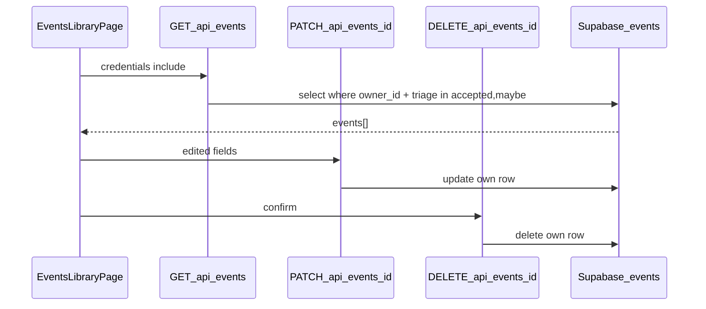

# Plan wdrożenia: My events library (S-04)

## Przegląd

Wdrażamy **S-04 / FR-004**: zalogowany rodzic na **`/events`** przegląda własne wydarzenia (`accepted` + `maybe`), **edytuje** wybrane pola inline oraz **usuwa** z potwierdzeniem. Persist przez nowe endpointy na `events` (RLS już gotowe). Publish (S-05), ręczne tworzenie (S-03) i upload obrazów poza zakresem.

**Decyzje podjęte** (research + planowanie):

| Decyzja              | Wybór                                                                          | Uzasadnienie                                                  | Źródło   |
| -------------------- | ------------------------------------------------------------------------------ | ------------------------------------------------------------- | -------- |
| Filtr listy          | Tylko `accepted` + `maybe`                                                     | Czytelna biblioteka; `rejected` zostaje w DB na metryki       | Plan     |
| Pola edycji          | `title`, `summary`, `description`, `place`, `child_age_years`, `location_kind` | FR-004 bez parsowania `starts_at` / bez zmiany triage/publish | Plan     |
| Obrazy               | Brak uploadu; opcjonalny link `source_url`                                     | Zero signed URL/SSRF; F-04 na S-03                            | Plan     |
| Ładowanie            | Client `fetch` jak `/suggestions`                                              | Spójny wzorzec island                                         | Plan     |
| Delete               | Hard delete + confirm UI                                                       | Proste; cleanup storage jeśli `image_path`                    | Plan     |
| Edit UX              | Inline na `/events`                                                            | Jeden route; bez nowego Dialog                                | Plan     |
| `owner_id` na liście | Zawsze `.eq("owner_id", userId)`                                               | RLS SELECT obejmuje też cudze published                       | Research |

## Analiza stanu obecnego

Z [research.md](research.md):

- **F-01:** tabela `events` + RLS owner CRUD + SELECT own/published.
- **S-02:** tylko `POST /api/events/triage` INSERT; wiersze `ai_suggested`, `is_published: false`, `image_path: null`.
- **Brak:** list/update/delete API, `/events` page, link Topbar, signed URL UI.
- **Auth:** default-deny — `/events` chronione bez zmian `route-access.ts`.
- **Brak test runnera** — lint/build + manual.

### Kluczowe odkrycia

- Wzorzec API: `src/pages/api/events/triage.ts`.
- Wzorzec UI: `src/pages/suggestions.astro` + `SuggestionsPage.tsx`.
- Typy: `EventRow`, `TablesUpdate<"events">`.
- Storage helpers istnieją, ale **nie używamy uploadu** w S-04; przy DELETE wywołaj cleanup tylko gdy `image_path` nie-null (defensywnie pod przyszłe S-03 rows).

## Pożądany stan końcowy

1. Topbar: link „Moje wydarzenia” → `/events`.
2. Lista własnych `accepted`/`maybe`, posortowana (`updated_at` desc).
3. Inline edit pól uzgodnionych; zapis `PATCH` → odświeżenie karty.
4. Usuń z confirm → `DELETE` → karta znika.
5. Empty / loading / error (PL, inline).
6. `npm run lint` + `npm run build`; manual smoke z sesją + lokalnym Supabase.

## Czego NIE robimy

- Publikacja `is_published` / S-05.
- Ręczne tworzenie wydarzenia (S-03).
- Upload / replace / signed URL obrazów.
- Pokazywanie `rejected` (zostają w DB, poza UI).
- Zmiana `triage_status`, `origin`, `owner_id`, `starts_at` z klienta.
- Migracje SQL (enumy/kolumny już są).
- Soft delete, toast library (sonner), test runner.
- prd-v2 FR-008/009 (unpublish/copy).

## Podejście do implementacji

Warstwy: **Zod + `lib/events`** → **API routes** → **`/events` island + Topbar**.

## Krytyczne szczegóły implementacji

- **Lista:** zawsze `.eq("owner_id", locals.user.id)` oraz `.in("triage_status", ["accepted", "maybe"])` — RLS sam nie wystarczy do UX biblioteki.
- **Update/Delete:** po operacji sprawdź, że wiersz istnieje i należy do ownera (pusty wynik RLS → **404**); nie ufaj body dla `owner_id`.
- **Delete + storage:** jeśli `image_path` ustawione, wywołaj istniejący helper remove przed/po DELETE wiersza (S-02 rows mają null — no-op).

---

## Faza 1: API list, update, delete

### Przegląd

Lib + Zod + trzy operacje HTTP na `events` (wzorzec triage).

### Wymagane zmiany

#### 1. Schematy Zod

**Plik:** `src/lib/events/event-update.schema.ts` (oraz ewentualnie wspólne typy statusów listy)

**Cel:** Walidacja body PATCH na granicy API.

**Kontrakt:**

- Dozwolone pola: `title`, `summary`, `description`, `place`, `childAge` (→ `child_age_years`), `locationKind` (`indoor` \| `outdoor` \| null / opcjonalnie brak klucza = bez zmiany).
- Stringi trim + sensowne max length (jak suggestion schemas).
- Schema **`.strict()`** — nieznane klucze (np. `is_published`, `owner_id`, `triage_status`) → błąd walidacji (400), nie ciche stripowanie jak w triage/suggestions.

#### 2. Lib: list / update / delete

**Plik:** `src/lib/events/` — np. `list-own-events.ts`, `update-own-event.ts`, `delete-own-event.ts` (nazwy dowolne, spójne z folderem)

**Cel:** Czyste funkcje: `SupabaseClient<Database>` + `ownerId` (+ `eventId` / patch).

**Kontrakt:**

- **List:** select potrzebnych kolumn; `owner_id` = ownerId; `triage_status` ∈ `{accepted, maybe}`; `order updated_at desc`.
- **Update:** `TablesUpdate<"events">` tylko z whitelisty; `.eq("id", eventId).eq("owner_id", ownerId)`; brak wiersza → not_found.
- **Delete:** opcjonalnie odczyt `image_path` → `removeEventImage` gdy path; potem `.delete().eq("id").eq("owner_id")`; brak wiersza → not_found.

#### 3. API routes

**Pliki:**

- `src/pages/api/events/index.ts` — `GET` lista
- `src/pages/api/events/[id].ts` — `PATCH`, `DELETE`

**Cel:** Authenticated JSON API jak `triage.ts`.

**Kontrakt:**

- Auth: `locals.user` → 401 `{ error: "unauthorized" }`.
- `createClient` null → 503 `{ error: "configuration" }`.
- GET → **200** `{ events: [...] }` (DTO: id, title, summary, description, place, child_age_years, location_kind, source_url, triage_status, updated_at — bez leakowania zbędnych pól).
- PATCH: JSON + Zod → 400 validation; sukces **200** `{ event }`; not_found **404**; DB **500** `{ error: "internal" }`.
- DELETE: sukces **204** (bez body); not_found **404**; UI sprawdza `response.ok` / status 204.

### Kryteria sukcesu

#### Weryfikacja automatyczna

- `npx astro sync` + `npm run lint` + `npm run build` przechodzą.

#### Weryfikacja ręczna

- Zalogowany: GET → tylko własne accepted/maybe; brak rejected i cudzych published.
- PATCH zmienia dozwolone pola; nieznane klucze (np. `is_published`) lub złe typy → 400 validation; obcy id → 404.
- DELETE usuwa wiersz; ponowny DELETE / obcy id → 404.
- Bez sesji → 401 JSON.

**Uwaga implementacyjna:** Po Fazie 1 zatrzymaj się na ręczne potwierdzenie przed Fazą 2.

---

## Faza 2: Strona biblioteki i lista

### Przegląd

Route `/events`, Topbar, island z listą (fetch GET), stany empty/loading/error.

### Wymagane zmiany

#### 1. Page shell

**Plik:** `src/pages/events.astro`

**Cel:** Chroniona strona produktowa jak `suggestions.astro`.

**Kontrakt:** `Layout` + `AppShell showTopbar` + `PanelCard` + React island `client:load`.

#### 2. Topbar

**Plik:** `src/components/Topbar.astro`

**Cel:** Link „Moje wydarzenia” → `/events` obok Propozycje / Panel.

#### 3. Lista UI

**Pliki:** `src/components/events/EventsLibraryPage.tsx` (+ ewentualnie `EventCard.tsx`)

**Cel:** Po mount: `GET /api/events` z `credentials: "include"`; render kart (title, summary, place, badge status, source_url link); empty / loading / ServerError PL.

**Kontrakt:** Klucz karty = `event.id`. Bez przycisków edit/delete jeszcze (albo placeholdery disabled — preferuj bez akcji do Fazy 3, żeby Faza 2 była czystym browse).

### Kryteria sukcesu

#### Weryfikacja automatyczna

- `npm run lint` + `npm run build` przechodzą.

#### Weryfikacja ręczna

- Zalogowany: Topbar → `/events` → lista zgodna z DB (accepted/maybe).
- Brak wydarzeń → empty state PL.
- Offline / 401 → komunikat błędu; karta nie crashuje.
- Niezalogowany → redirect na signin.

**Uwaga implementacyjna:** Po Fazie 2 zatrzymaj się na ręczne potwierdzenie przed Fazą 3.

---

## Faza 3: Inline edit, delete confirm, dokumentacja

### Przegląd

Akcje na karcie: edycja inline + usuwanie z confirm; krótka wzmianka w README; smoke E2E.

### Wymagane zmiany

#### 1. Inline edit

**Plik:** `src/components/events/*` (EventsLibraryPage / EventCard)

**Cel:** „Edytuj” rozwija formularz (reuse `FormField` / `Button`); Save → PATCH; Cancel zamyka bez zapisu; pending disable; sukces aktualizuje lokalny state; błąd inline PL.

**Kontrakt:** Pola jak w Zod update schema; `locationKind` select indoor/outdoor (+ opcja „bez zmiany” / null wg kontraktu Fazy 1).

#### 2. Delete confirm

**Cel:** „Usuń” → confirm (np. `window.confirm` lub prosty inline „Na pewno?” + Tak/Nie — bez nowej lib Dialog); DELETE → usuń z listy; błąd → komunikat, karta zostaje.

#### 3. README

**Plik:** `README.md`

**Cel:** 1 krótki akapit / bullet: `/events` — przeglądanie, edycja, usuwanie własnych accepted/maybe; bez publikacji / bez uploadu obrazów.

### Kryteria sukcesu

#### Weryfikacja automatyczna

- `npx astro sync` + `npm run lint` + `npm run build` przechodzą.

#### Weryfikacja ręczna

- E2E: triage accept/maybe → widać w `/events` → edit zapisuje → delete z confirm usuwa z UI i DB.
- Rejected z triage **nie** pojawia się na liście.
- README wspomina bibliotekę.

---

## Strategia testowania

### Testy jednostkowe

- Brak runnera — nie dodajemy w S-04.
- Mapowanie/Zod: weryfikuj ręcznie PATCH whitelist i filtr listy.

### Testy integracyjne

- Manual GET/PATCH/DELETE + UI smoke jak w kryteriach faz.

### Kroki testowania ręcznego

1. `npx supabase start` + lokalne env + `npm run dev`.
2. Zaloguj → `/suggestions` → accept + maybe (+ reject kontrolnie).
3. `/events` — widać accept/maybe, nie rejected.
4. Edit + delete; sprawdź Studio SQL.

## Uwagi dotyczące wydajności

Jedno SELECT na listę; brak paginacji w MVP (wolumeny MVP niskie). Opcjonalny indeks `(owner_id, updated_at)` poza zakresem, chyba że pojawi się realny problem.

## Uwagi dotyczące migracji

Brak migracji SQL. Wycofanie: usunąć routes + UI + Topbar link; wiersze `events` pozostają.

## Referencje

- Badania: `context/changes/my-events-library/research.md`
- Roadmap S-04: `context/foundation/roadmap.md`
- Archiwum S-02: `context/archive/2026-07-16-triage-suggestions/`
- Wzorzec API: `src/pages/api/events/triage.ts`
- Wzorzec UI: `src/pages/suggestions.astro`, `SuggestionsPage.tsx`
- Schema: `supabase/migrations/20260526120000_events_schema_and_rls.sql`

## Progress

> Konwencja: `- [ ]` oczekujące, `- [x]` wykonane. Dodaj ` — <commit sha>` gdy krok zostanie zrealizowany. Nie zmieniaj nazw tytułów kroków.

### Faza 1: API list, update, delete

#### Automatyczne

- [x] 1.1 `npx astro sync` + `npm run lint` + `npm run build` — 11b468e

#### Ręczne

- [x] 1.2 GET lista → tylko własne accepted/maybe — 11b468e
- [x] 1.3 PATCH dozwolone pola; nieznane klucze / złe typy → 400; obcy id → 404 — 11b468e
- [x] 1.4 DELETE usuwa; ponowny/obcy → 404 — 11b468e
- [x] 1.5 Bez sesji → 401 JSON — 11b468e

### Faza 2: Strona biblioteki i lista

#### Automatyczne

- [x] 2.1 `npm run lint` + `npm run build`

#### Ręczne

- [x] 2.2 Topbar → `/events` → lista zgodna z DB (accepted/maybe)
- [x] 2.3 Brak wydarzeń → empty state PL
- [x] 2.4 Offline / 401 → komunikat błędu; UI nie crashuje
- [x] 2.5 Niezalogowany → redirect signin

### Faza 3: Inline edit, delete confirm, dokumentacja

#### Automatyczne

- [ ] 3.1 `npx astro sync` + `npm run lint` + `npm run build`

#### Ręczne

- [ ] 3.2 E2E: triage accept/maybe → edit zapisuje → delete z confirm usuwa
- [ ] 3.3 Rejected z triage nie pojawia się na liście
- [ ] 3.4 README wspomina bibliotekę `/events`
