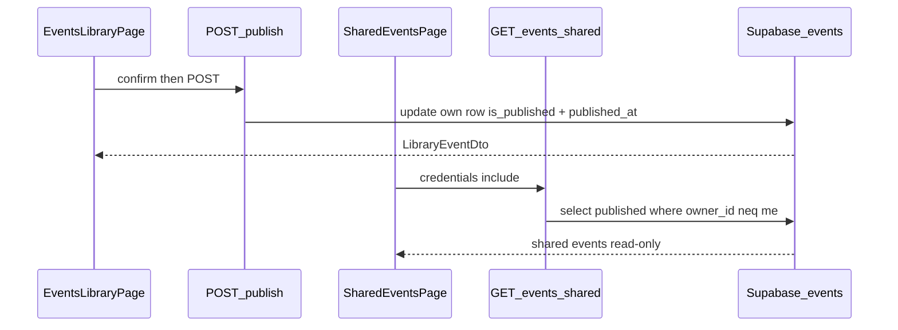

# Plan wdrożenia: Publish shared event (S-05)

## Przegląd

Wdrażamy **S-05 / FR-006**: zalogowany rodzic **świadomie publikuje** własne wydarzenie z biblioteki (`accepted`/`maybe`) oraz przegląda **cudze** published w trybie tylko do odczytu na `/events/shared`. Kolumny i RLS (`is_published`, `published_at`, SELECT own-or-published) są już z F-01 — brak migracji.

**Decyzje podjęte** (research + planowanie):

| Decyzja          | Wybór                                    | Uzasadnienie                                                           | Źródło   |
| ---------------- | ---------------------------------------- | ---------------------------------------------------------------------- | -------- |
| Ścieżka browse   | `/events/shared`                         | Obok biblioteki; czytelne „moje vs shared”                             | Plan     |
| Zawartość browse | Tylko cudze (`neq owner_id`)             | Zero duplikatów z `/events`                                            | Plan     |
| Kontrakt publish | `POST /api/events/[id]/publish`          | Nie psuje strict PATCH S-04; atomowe `published_at` po stronie serwera | Research |
| Po publish (UI)  | Badge „Opublikowane” + ukryj Opublikuj   | Jasny stan bez unpublish (FR-008 poza zakresem)                        | Plan     |
| Confirm publish  | Inline confirm (jak Usuń)                | Świadoma akcja = FR-006                                                | Plan     |
| Błędy API        | `409 already_published`; `404 not_found` | Jawne stany dla UI                                                     | Plan     |

## Analiza stanu obecnego

Z [research.md](research.md) i archiwum S-04:

- **F-01:** `is_published` + `published_at` + CHECK; RLS SELECT authenticated: own **lub** published; UPDATE/DELETE tylko owner.
- **S-04:** `GET/PATCH/DELETE /api/events`, `/events` island, Topbar „Moje wydarzenia”. Lista zawsze `.eq("owner_id")` mimo RLS published.
- **PATCH** `.strict()` — brak `is_published` (celowe wykluczenie S-04).
- **DTO** `LibraryEventDto` bez pól publish — badge/przycisk niemożliwe bez rozszerzenia select.
- **Brak:** publish API, browse list, `/events/shared`, link Topbar do shared.
- **Auth:** default-deny — nowe trasy chronione bez zmian `route-access.ts`.
- **Brak test runnera** — lint/build + manual.

### Kluczowe odkrycia:

- Wzorzec API bez body: `DELETE` w `src/pages/api/events/[id].ts` — wzór dla `POST …/publish`.
- Nested route: `src/pages/api/events/[id]/publish.ts` → `POST /api/events/:id/publish` (brak precedensu nested; Astro to obsługuje).
- Browse list: osobny `GET /api/events/shared` obok `index.ts` — **nie reuse** `GET /api/events`.
- Hook UI: `EventCard` action row (Edytuj/Usuń) + wzorzec `confirmDelete`.
- `update-own-event` / `list-own-events` dzielą kształt DTO — po rozszerzeniu `LibraryEventDto` oba SELECT muszą zwracać `is_published` (+ `published_at` jeśli w DTO).

## Pożądany stan końcowy

1. W bibliotece: nieopublikowane `accepted`/`maybe` mają **Opublikuj** z inline confirm; po sukcesie badge „Opublikowane” i brak przycisku publish.
2. `POST /api/events/:id/publish` ustawia `is_published: true` + `published_at: now()` (serwer); zwraca zaktualizowany `LibraryEventDto`; `409` gdy już published; `404` gdy nie własne / zły triage / brak.
3. Topbar: link do `/events/shared`.
4. `/events/shared`: lista **cudzych** published, read-only (bez edit/delete/publish), empty/loading/error jak biblioteka.
5. Akceptacja triage bez publish pozostaje prywatna (regresja S-02/S-04).
6. `npm run lint` + `npm run build`; manual smoke z dwoma kontami / lokalnym Supabase.

## Czego NIE robimy

- Unpublish / delete-from-public-list jako osobna akcja (FR-008) — delete z biblioteki już usuwa wiersz (i znika z published przez RLS).
- Copy cudzego wydarzenia (FR-009) / UI provenance.
- AI filter na public events (FR-007).
- Published read obrazów eventów (F-04 deferred): signed URL / storage policy dla cudzych published — poza S-05; osobny change (biblioteka i browse nie pokazują obrazów w tym slice).
- Rozszerzenie ogólnego `PATCH` o `is_published`.
- Pokazywanie własnych published na browse.
- Migracje SQL (kolumny/CHECK/RLS już są).
- Zmiany `route-access.ts` / middleware.
- Toast library, test runner, anon dostęp do published.

## Podejście do implementacji

Warstwy: **lib publish + list shared** → **API** → **EventCard confirm/badge** → **strona shared + Topbar**.

## Krytyczne szczegóły implementacji

- **Lista własna nadal z `owner_id`:** rozszerzenie DTO o publish **nie** zmienia filtra biblioteki — RLS nadal oddaje też cudze published.
- **`published_at` tylko serwer:** lib ustawia `new Date().toISOString()` (lub ekwiwalent) przy publish; klient nie wysyła timestampu — CHECK wymaga NOT NULL gdy `is_published`.
- **PATCH po publish:** `update-own-event` musi selectować nowe pola DTO, inaczej karta po Edytuj zgubi badge.

## Faza 1: Publish backend + DTO biblioteki

### Przegląd

Dedykowany publish w lib/API oraz pola publish w kontrakcie listy/update własnych wydarzeń — bez UI.

### Wymagane zmiany:

#### 1. Rozszerzenie `LibraryEventDto` i selectów

**Plik**: `src/lib/events/list-own-events.ts`

**Cel**: Biblioteka i odpowiedzi mutacji znają stan publikacji, żeby UI mógł pokazać badge i ukryć Opublikuj.

**Kontrakt**: Dodać do `LibraryEventDto` / `LIST_COLUMNS` / mappera: `is_published: boolean`, `published_at: string | null`. Filtr listy bez zmian (`owner_id` + triage accepted/maybe).

#### 2. Spójny SELECT po update

**Plik**: `src/lib/events/update-own-event.ts`

**Cel**: `PATCH` zwraca ten sam kształt DTO co lista — bez utraty pól publish po edycji.

**Kontrakt**: `SELECT_COLUMNS` i mapper `toLibraryEventDto` zgodne z rozszerzonym `LibraryEventDto`.

#### 3. Lib publish

**Plik**: `src/lib/events/publish-own-event.ts` (nowy)

**Cel**: Atomowa publikacja własnego accepted/maybe z serwerowym `published_at`.

**Kontrakt**: `publishOwnEvent(client, ownerId, eventId) → { event: LibraryEventDto } | { error: "not_found" | "already_published" | "publish_failed" }`. Warunki sukcesu: `owner_id` + `id` + triage in accepted/maybe + `is_published = false`. Update: `is_published: true`, `published_at: <now>`. Brak pasującego wiersza → rozróżnij już published (własne accepted/maybe z `is_published true`) vs reszta → odpowiednio `already_published` / `not_found`.

#### 4. Route publish

**Plik**: `src/pages/api/events/[id]/publish.ts` (nowy)

**Cel**: HTTP wejście dla świadomej publikacji, wzorowane na DELETE `[id].ts` (auth, UUID param, supabase, mapowanie błędów).

**Kontrakt**: `POST` bez body. Auth → `eventIdParamSchema` → lib. Mapowanie: `unauthorized` 401, `validation` 400, `configuration` 503, `not_found` 404, `already_published` 409, `publish_failed`/`internal` 500. Sukces: `{ event }` **200**. Nie rozszerzać `event-update.schema.ts`.

### Kryteria sukcesu:

#### Weryfikacja automatyczna:

- Istnieje `src/lib/events/publish-own-event.ts` i `src/pages/api/events/[id]/publish.ts`
- `LibraryEventDto` zawiera `is_published` i `published_at`; list + update selectują te kolumny
- `event-update.schema.ts` nadal `.strict()` bez `is_published`
- `npx astro sync` + `npm run lint` przechodzą
- `npm run build` przechodzi (z env Supabase)

#### Weryfikacja ręczna:

- `POST /api/events/<id>/publish` (sesja ownera, niepublished accepted/maybe) → 200, w DB `is_published=true` i `published_at` ustawione
- Ponowny POST tego samego id → 409 `already_published`
- POST cudzego / rejected / losowego UUID → 404
- `GET /api/events` zwraca `is_published` / `published_at` na elementach
- `PATCH` z `is_published` w body → 400 validation (regresja S-04)

**Uwaga implementacyjna**: Po tej fazie zatrzymaj się na ręczne potwierdzenie przed Fazą 2.

---

## Faza 2: UI biblioteki — Opublikuj

### Przegląd

Świadomy publish z karty wydarzenia: confirm, badge, ukrycie przycisku; bez browse.

### Wymagane zmiany:

#### 1. EventCard — publish UX

**Plik**: `src/components/events/EventCard.tsx`

**Cel**: Rodzic świadomie publikuje z biblioteki; po sukcesie widzi stan published bez możliwości ponownego publish (S-05).

**Kontrakt**: Gdy `!event.is_published` — przycisk Opublikuj w action row (obok Edytuj/Usuń) + inline confirm z komunikatem, że inni rodzice zobaczą wydarzenie (wzorzec `confirmDelete`). `POST /api/events/${id}/publish` → `onUpdated(event)`. Gdy `event.is_published` — badge „Opublikowane” (obok/triage), **brak** przycisku Opublikuj. Obsługa 409/4xx jako `actionError` (PL). `busy` obejmuje stan publish pending; wzajemne wykluczanie confirm publish vs delete.

#### 2. EventsLibraryPage — bez zmian kontraktu parent (opcjonalny przegląd)

**Plik**: `src/components/events/EventsLibraryPage.tsx`

**Cel**: Upewnić się, że istniejące `onUpdated` zastępuje kartę po publish (już po id).

**Kontrakt**: Brak nowego API props, jeśli `onUpdated` już podmienia event po `id`. Dostosuj tylko jeśli typy/`LibraryEventDto` wymagają importu.

### Kryteria sukcesu:

#### Weryfikacja automatyczna:

- `npm run lint` przechodzi na zmienionych plikach UI
- `npm run build` przechodzi

#### Weryfikacja ręczna:

- Niepublished: Opublikuj → confirm → sukces → badge, brak Opublikuj, karta zostaje w liście
- Anuluj confirm → brak wywołania API
- Już published (po reload): tylko badge, brak Opublikuj
- Edit/Usuń nadal działają na published i niepublished
- Błąd sieci / 409 pokazuje komunikat inline, bez crasha

**Uwaga implementacyjna**: Po tej fazie zatrzymaj się na ręczne potwierdzenie przed Fazą 3.

---

## Faza 3: Browse shared + nawigacja

### Przegląd

Read-only lista cudzych published + strona + link Topbar.

### Wymagane zmiany:

#### 1. Lib list published (cudze)

**Plik**: `src/lib/events/list-published-events.ts` (nowy)

**Cel**: Feed społeczności bez własnych wierszy i bez mutacji.

**Kontrakt**: `listPublishedEvents(client, viewerId) → { events: SharedEventDto[] } | { error: "list_failed" }`. Filtr: `is_published = true`, `owner_id != viewerId`. Sort np. `published_at` desc (fallback `updated_at`). `SharedEventDto`: pola potrzebne do read-only karty (tytuł, summary, place, age, location_kind, source_url, `published_at`) — **bez** akcji edit/delete/publish; nie ekspozycja `owner_id` w JSON, jeśli nie jest potrzebne w UI S-05.

#### 2. API shared list

**Plik**: `src/pages/api/events/shared.ts` (nowy)

**Cel**: Endpoint browse dla zalogowanych rodziców.

**Kontrakt**: `GET` → `{ events }` **200**. Auth 401, configuration 503, list_failed 500. Nie zmieniać `GET /api/events` (index).

#### 3. Strona i island read-only

**Pliki**: `src/pages/events/shared.astro` (nowy), `src/components/events/SharedEventsPage.tsx` (nowy), `src/components/events/SharedEventCard.tsx` (nowy)

**Cel**: Widok `/events/shared` z loading/empty/error jak biblioteka; karty tylko do odczytu.

**Kontrakt**: Astro layout jak `events.astro` (AppShell + PanelCard). Island: `fetch("/api/events/shared", { credentials: "include" })`. **Nie reuse** `EventCard` (wymaga handlerów mutacji i renderuje Edytuj/Usuń). Osobny `SharedEventCard`: tylko wyświetlanie pól `SharedEventDto` — **bez** propsów `onUpdated`/`onDeleted` i **bez** przycisków Edytuj/Usuń/Opublikuj. Empty state PL gdy brak cudzych published.

#### 4. Topbar

**Plik**: `src/components/Topbar.astro`

**Cel**: Odkrywalność browse obok biblioteki.

**Kontrakt**: Link (np. „Udostępnione” / „Wydarzenia innych”) → `/events/shared` w grupie authenticated, ten sam styl co istniejące `<a>`.

### Kryteria sukcesu:

#### Weryfikacja automatyczna:

- Istnieją `list-published-events.ts`, `shared.ts` API, `events/shared.astro`, `SharedEventsPage`, `SharedEventCard` (bez reuse `EventCard`)
- `npx astro sync` + `npm run lint` + `npm run build` przechodzą

#### Weryfikacja ręczna:

- Konto A publikuje; konto B na `/events/shared` widzi wydarzenie A (read-only)
- Konto A **nie** widzi własnego published na `/events/shared`
- Konto B nie ma Edytuj/Usuń/Opublikuj na cudzej karcie
- Niezalogowany → redirect na sign-in (default-deny)
- Topbar prowadzi do `/events/shared`
- `GET /api/events` nadal tylko własne (regresja S-04)

**Uwaga implementacyjna**: Po Fazie 3 — smoke end-to-end FR-006; zmiana gotowa do review / archive po merge.

---

## Strategia testowania

### Testy jednostkowe:

- Brak runnera — nie dodajemy w S-05.

### Testy integracyjne:

- Manual HTTP: publish 200/409/404; shared list filtr `neq owner_id`.

### Kroki testowania ręcznego:

1. Dwa konta lokalnie (lub dwa profile): A publish z `/events`, B browse `/events/shared`.
2. A: confirm → badge; reload → nadal badge, brak Opublikuj.
3. A: drugi POST publish (DevTools) → 409.
4. B: brak mutacji UI; empty state gdy nic nie published.
5. Regresja: triage accept bez publish → niewidoczne dla B; PATCH library bez `is_published`.

## Uwagi dotyczące wydajności

Partial index `events_is_published_idx` już istnieje — browse opiera się na `is_published`. Brak paginacji w MVP (jak biblioteka S-04); OK przy małych wolumenach.

## Uwagi dotyczące migracji

Brak migracji SQL. Istniejące wiersze mają `is_published = false`. Delete z biblioteki nadal hard-delete — published znika z browse automatycznie.

## Referencje

- Badania: `context/changes/publish-shared-event/research.md`
- Roadmap S-05: `context/foundation/roadmap.md`
- S-04 (wzorzec + `owner_id` filter): `context/archive/2026-07-24-my-events-library/`
- Schema/RLS publish: `supabase/migrations/20260526120000_events_schema_and_rls.sql`
- API wzorzec: `src/pages/api/events/[id].ts`
- UI wzorzec: `src/components/events/EventCard.tsx`, `EventsLibraryPage.tsx`

## Progress

> Konwencja: `- [ ]` oczekujące, `- [x]` wykonane. Dodaj ` — <commit sha>`, gdy krok zostanie zrealizowany. Nie zmieniaj nazw tytułów kroków.

### Faza 1: Publish backend + DTO biblioteki

#### Automatyczne

- [ ] 1.1 Istnieją publish-own-event.ts i api/events/[id]/publish.ts
- [ ] 1.2 LibraryEventDto + list/update select zawierają is_published i published_at
- [ ] 1.3 event-update.schema nadal strict bez is_published
- [ ] 1.4 npx astro sync + npm run lint przechodzą
- [ ] 1.5 npm run build przechodzi

#### Ręczne

- [ ] 1.6 POST publish → 200 i DB is_published + published_at
- [ ] 1.7 Ponowny POST → 409 already_published
- [ ] 1.8 Cudze/rejected/losowe id → 404
- [ ] 1.9 GET /api/events zwraca pola publish
- [ ] 1.10 PATCH z is_published → 400

### Faza 2: UI biblioteki — Opublikuj

#### Automatyczne

- [ ] 2.1 npm run lint przechodzi (UI)
- [ ] 2.2 npm run build przechodzi

#### Ręczne

- [ ] 2.3 Confirm → publish → badge + brak Opublikuj
- [ ] 2.4 Anuluj confirm → brak API call
- [ ] 2.5 Reload published → tylko badge
- [ ] 2.6 Edit/Usuń nadal działają
- [ ] 2.7 Błąd 409/sieć → komunikat inline

### Faza 3: Browse shared + nawigacja

#### Automatyczne

- [ ] 3.1 Istnieją list-published-events, shared API, shared.astro, SharedEventsPage, SharedEventCard
- [ ] 3.2 npx astro sync + npm run lint + npm run build przechodzą

#### Ręczne

- [ ] 3.3 Konto B widzi published konta A read-only
- [ ] 3.4 Konto A nie widzi własnych na /events/shared
- [ ] 3.5 Brak akcji mutacji na cudzej karcie
- [ ] 3.6 Niezalogowany → redirect sign-in
- [ ] 3.7 Topbar link do /events/shared
- [ ] 3.8 GET /api/events nadal tylko własne
