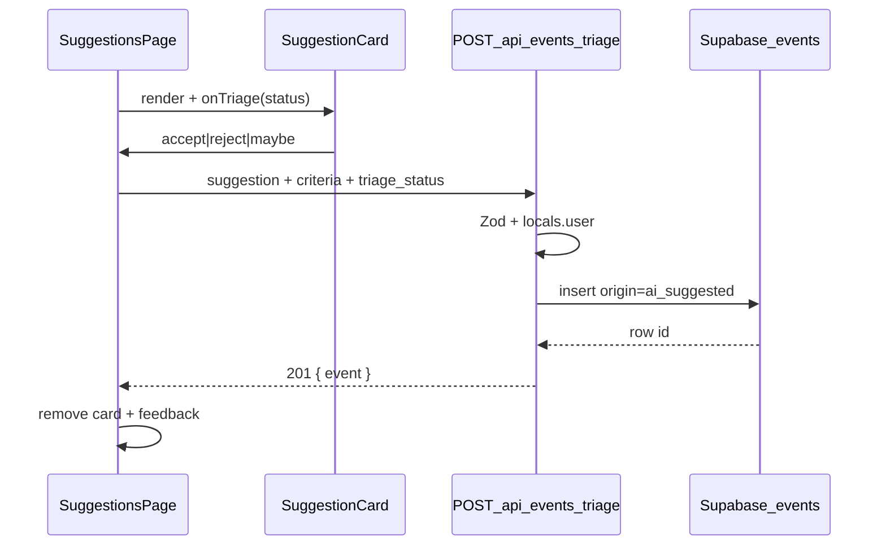

# Plan wdrożenia: Triage suggestions (S-02)

## Przegląd

Wdrażamy **S-02 / FR-005**: na kartach propozycji AI rodzic może **zaakceptować, odrzucić lub oznaczyć „może później”**, a decyzja jest **zapisana w `events`** (`origin: ai_suggested`, `triage_status` od razu). Publikacja (S-05) i biblioteka CRUD (S-04) poza zakresem. Generowanie AI (`POST /api/ai/suggestions`) pozostaje bez zmian.

**Decyzje podjęte** (research + planowanie):

| Decyzja                    | Wybór                                       | Uzasadnienie                                   | Źródło      |
| -------------------------- | ------------------------------------------- | ---------------------------------------------- | ----------- |
| Status INSERT              | Od razu `accepted` \| `rejected` \| `maybe` | Jeden round-trip; karty bez id                 | Plan        |
| Reject                     | Też INSERT wiersza                          | Metryka 70% + pełna historia decyzji           | Plan        |
| `either` → `location_kind` | `NULL`                                      | Kolumna nullable; zero tarcia UX               | Plan        |
| `time` → `starts_at`       | `starts_at` NULL; free-text w `description` | Brak kolumny na swobodny czas; zero parsowania | Plan        |
| Obraz                      | Bez uploadu do `event-images`               | Zero SSRF/download; F-04 na S-03/S-04          | Plan        |
| UX po decyzji              | Karta znika + inline feedback               | Jasny progress; mniej double-submit            | Plan        |
| Tożsamość karty            | Stabilne `clientId` (UUID) lokalnie w UI    | Bezpieczny pending/filter po usunięciu         | Plan-review |
| API                        | Osobny `POST /api/events/triage`            | Nie mieszać z generowaniem AI                  | Research    |

## Analiza stanu obecnego

Z [research.md](research.md) — potwierdzone w kodzie:

- **S-01 gotowe:** `/suggestions` → `SuggestionsPage` → karty (`SuggestionCard`) — **bez przycisków triage**, wyniki tylko w React state.
- **F-01 gotowe:** tabela `events` + enum `event_triage_status` + RLS insert-own (`supabase/migrations/20260526120000_events_schema_and_rls.sql`).
- **F-04 gotowe:** `uploadEventImage` — **nie używamy w S-02**.
- **Brak:** `.from("events")` w `src/`, `lib/events/*`, API CRUD events, toast (tylko `Button` + wzorzec `ServerError`).
- **Auth:** middleware 401 JSON dla `/api/*`; `locals.user` only — insert przez `createClient(headers, cookies)`.
- **Brak test runnera** — weryfikacja: lint/build + manual.

### Kluczowe odkrycia

- Naturalny hook UI: `SuggestionCard.tsx` (stopka po summary/link) + handlery w `SuggestionsPage.tsx`.
- Wzorzec API: `src/pages/api/ai/suggestions.ts` (auth + Zod + `jsonResponse`).
- Klucz karty dziś: `` `${title}-${index}` `` — **niebezpieczny po usunięciu** (przesunięcie indeksów). W S-02: przy `setSuggestions` po generate nadaj każdej karcie stabilne `clientId` (`crypto.randomUUID()`); React `key`, pending i filter po sukcesie wyłącznie po `clientId`.

## Pożądany stan końcowy

1. Po wygenerowaniu propozycji każda karta ma trzy akcje: Akceptuj / Odrzuć / Może później.
2. Klik → `POST /api/events/triage` → INSERT wiersza `events` z właściwym `triage_status` (w tym reject).
3. Po sukcesie karta znika z listy; widoczny krótki feedback (inline, PL).
4. `is_published` pozostaje `false`; brak uploadu obrazu; `source_url` zapisany gdy był.
5. `npm run lint` + `npm run build` przechodzą; manual smoke z sesją + lokalnym Supabase.

## Czego NIE robimy

- Upload OG → `event-images` / signed URL (S-03/S-04).
- Publikacja `is_published` (S-05), biblioteka CRUD (S-04).
- Zmiana `POST /api/ai/suggestions` (generowanie zostaje transient).
- Migracje schematu (enumy/kolumny już są).
- Parsowanie `time` do `timestamptz`, wymuszanie `location_kind` przy `either`.
- Toast library (sonner) — tylko inline feedback.
- Test runner.

## Podejście do implementacji

Warstwy: **Zod + `lib/events` map/insert** → **API route** → **UI buttons + state**.

## Krytyczne szczegóły implementacji

- **Kolejność insert:** najpierw INSERT (bez obrazu); nie wołaj `uploadEventImage` w S-02.
- **Double-submit:** disable wszystkich trzech przycisków na karcie na czas trwania requestu tej karty; po błędzie odblokuj i pokaż błąd (karta zostaje).
- **Stabilne id karty:** po generate mapuj `EnrichedSuggestionItem` → `{ ...item, clientId: crypto.randomUUID() }`. Pending = `Set`/`Record` keyed by `clientId`. Po 201: `filter(s => s.clientId !== id)`. **Nie** wysyłaj `clientId` w body API (tylko lokalny UI).
- **`owner_id`:** zawsze `locals.user.id` — nie ufaj body klienckiemu dla właściciela.

---

## Faza 1: API triage i mapowanie suggestion → event

### Przegląd

Kontrakt Zod, helper mapujący kryteria + suggestion → wiersz `events`, oraz `POST /api/events/triage` z auth + INSERT przez RLS.

### Wymagane zmiany

#### 1. Schemat requestu triage

**Plik:** `src/lib/events/triage-request.schema.ts`

**Cel:** Walidacja body JSON na granicy API.

**Kontrakt:**

- `triageStatus`: `accepted` \| `rejected` \| `maybe` (nie `draft`/`pending`).
- `suggestion`: `{ title, summary, sourceUrl?, imageUrl? }` — mirror `EnrichedSuggestionItem` (imageUrl ignorowany przy persist).
- `criteria`: `{ place, time, childAge, indoorOutdoor }` — mirror `suggestionRequestSchema`.

#### 2. Mapowanie + insert

**Plik:** `src/lib/events/create-event-from-suggestion.ts` (lub równoważna nazwa w `src/lib/events/`)

**Cel:** Czysta funkcja mapująca input → payload Insert + wywołanie `.from("events").insert(...).select().single()`.

**Kontrakt mapowania:**

| Pole events       | Źródło                                            |
| ----------------- | ------------------------------------------------- |
| `owner_id`        | `user.id`                                         |
| `title`           | `suggestion.title`                                |
| `summary`         | `suggestion.summary`                              |
| `source_url`      | `suggestion.sourceUrl` lub null                   |
| `image_path`      | zawsze null (S-02)                                |
| `place`           | `criteria.place`                                  |
| `starts_at`       | zawsze null                                       |
| `description`     | free-text `criteria.time` (np. prefiks „Czas: …”) |
| `child_age_years` | `criteria.childAge`                               |
| `location_kind`   | `indoor`/`outdoor` albo **null** gdy `either`     |
| `origin`          | `ai_suggested`                                    |
| `triage_status`   | request `triageStatus`                            |
| `is_published`    | `false`                                           |

#### 3. API route

**Plik:** `src/pages/api/events/triage.ts`

**Cel:** Authenticated JSON POST — wzorzec jak `api/ai/suggestions.ts`.

**Kontrakt:**

- Auth: `locals.user` → 401 `{ error: "unauthorized" }` (defense in depth; middleware też).
- Content-Type JSON; Zod `safeParse` → 400 `{ error: "validation", issues }`.
- `createClient(request.headers, cookies)` — jeśli `null` (brak env) → **503** `{ error: "configuration" }`.
- Insert helper z klientem + `owner_id` z `locals.user.id`.
- Sukces: **201** `{ event: { id, triage_status, title } }` (minimalny DTO).
- Błąd DB/RLS: 500 `{ error: "internal" }` (bez leakowania szczegółów).

### Kryteria sukcesu

#### Weryfikacja automatyczna

- `npx astro sync` + `npm run lint` + `npm run build` przechodzą.

#### Weryfikacja ręczna

- Zalogowany: `POST /api/events/triage` z poprawnym body → 201; wiersz w `events` z oczekiwanym `triage_status`.
- Reject też tworzy wiersz ze statusem `rejected`.
- `indoorOutdoor: either` → `location_kind` IS NULL; `starts_at` IS NULL; `description` zawiera time.
- Bez sesji → 401 JSON.
- Złe body → 400 validation.

**Uwaga implementacyjna:** Po Fazie 1 zatrzymaj się na ręczne potwierdzenie przed Fazą 2.

---

## Faza 2: UI decyzji na kartach

### Przegląd

Przyciski triage na `SuggestionCard`, wiring w `SuggestionsPage`, loading/disable, usuwanie karty po sukcesie, inline feedback.

### Wymagane zmiany

#### 1. SuggestionCard — akcje

**Plik:** `src/components/suggestions/SuggestionCard.tsx`

**Cel:** Trzy przyciski (Akceptuj / Odrzuć / Może później) w stopce karty; reuse `Button`.

**Kontrakt:** Props `clientId: string`, `onTriage?: (status: "accepted" | "rejected" | "maybe") => void`, `triagePending?: boolean` (disable wszystkich akcji). Warianty wizualne: accept = default/secondary, reject = outline/destructive-ish, maybe = outline — spójne z istniejącym amber/slate UI.

#### 2. SuggestionsPage — fetch + stan

**Plik:** `src/components/suggestions/SuggestionsPage.tsx`

**Cel:** Handler triage: `fetch("/api/events/triage", …)` z suggestion + ostatnimi kryteriami + status; po 201 usuń kartę ze state; pokaż krótki feedback (sukces/błąd) — wzorzec jak `ServerError` / banner nad listą.

**Kontrakt:**

- Kryteria z ostatniego udanego submitu formularza (trzymaj w state obok `suggestions`).
- Po udanym generate: `setSuggestions(items.map(s => ({ ...s, clientId: crypto.randomUUID() })))`.
- Pending keyed by `clientId` — tylko ta karta disabled.
- Po sukcesie: `setSuggestions(prev => prev.filter(s => s.clientId !== clientId))` + komunikat PL („Zapisano” / „Odrzucono” / „Zapisano na później”).
- Po błędzie: karta zostaje; komunikat błędu PL.

### Kryteria sukcesu

#### Weryfikacja automatyczna

- `npm run lint` + `npm run build` przechodzą.

#### Weryfikacja ręczna

- Po wygenerowaniu propozycji widać 3 przyciski na każdej karcie.
- Accept → karta znika, feedback sukcesu, wiersz `accepted` w DB.
- Reject / Maybe → analogicznie ze właściwym statusem.
- Podczas requestu przyciski tej karty disabled; double-click nie tworzy duplikatu.
- Błąd API (np. offline) → karta zostaje + komunikat.

**Uwaga implementacyjna:** Po Fazie 2 zatrzymaj się na ręczne potwierdzenie przed Fazą 3.

---

## Faza 3: Smoke, dokumentacja, zamknięcie

### Przegląd

Krótka dokumentacja flow triage + pełny smoke E2E na ścieżce S-01→S-02.

### Wymagane zmiany

#### 1. README / docs

**Plik:** `README.md` (sekcja produktowa lub „Suggestions”)

**Cel:** Jedna krótka wzmianka: po wygenerowaniu propozycji można accept/reject/maybe; zapis do `events`; bez publikacji.

**Kontrakt:** Nie rozbudowuj README poza 1 krótkim akapitem / bulletami.

#### 2. Smoke (manual checklist w plan Progress)

Brak nowego skryptu wymaganego — checklist ręczny w Progress wystarczy. Opcjonalnie dopisz komendy curl do Notes jeśli pomaga.

### Kryteria sukcesu

#### Weryfikacja automatyczna

- `npx astro sync` + `npm run lint` + `npm run build` przechodzą.

#### Weryfikacja ręczna

- E2E: zaloguj → `/suggestions` → kryteria → propozycje → accept jednej, reject drugiej, maybe trzeciej → trzy wiersze w `events` z różnymi statusami, `is_published = false`, `origin = ai_suggested`.
- README wspomina triage.

---

## Strategia testowania

### Testy jednostkowe

- Brak runnera — nie dodajemy w S-02.
- Mapowanie: weryfikuj ręcznie przypadki `either` / reject / description time.

### Testy integracyjne

- Manual POST + UI smoke jak w kryteriach faz.

### Kroki testowania ręcznego

1. `npx supabase start` (jeśli lokalnie) + env.
2. Zaloguj → wygeneruj propozycje.
3. Kliknij każdą decyzję na osobnej karcie; sprawdź DB.
4. Odśwież `/suggestions` — lista pusta do nowego generate (oczekiwane).

## Uwagi dotyczące wydajności

Jeden INSERT na decyzję; brak dodatkowych fetchy OG. Niskie obciążenie.

## Uwagi dotyczące migracji

Brak migracji SQL. Istniejące puste/nieużywane `events` bez zmian. Wycofanie: usunąć route + UI; wiersze triage pozostają (akceptowalne).

## Referencje

- Badania: `context/changes/triage-suggestions/research.md`
- Roadmap S-02: `context/foundation/roadmap.md`
- Archiwum S-01: `context/archive/2026-06-22-ai-activity-suggestions/`
- Wzorzec API: `src/pages/api/ai/suggestions.ts`
- Schema: `supabase/migrations/20260526120000_events_schema_and_rls.sql`
- UI: `src/components/suggestions/SuggestionCard.tsx`, `SuggestionsPage.tsx`

## Progress

> Konwencja: `- [ ]` oczekujące, `- [x]` wykonane. Dodaj ` — <commit sha>` gdy krok zostanie zrealizowany. Nie zmieniaj nazw tytułów kroków.

### Faza 1: API triage i mapowanie suggestion → event

#### Automatyczne

- [x] 1.1 `npx astro sync` + `npm run lint` + `npm run build`

#### Ręczne

- [x] 1.2 POST triage → 201 + wiersz z właściwym `triage_status`
- [x] 1.3 Reject tworzy wiersz `rejected`
- [x] 1.4 `either` → `location_kind` NULL; time w `description`; `starts_at` NULL
- [x] 1.5 Bez sesji → 401 JSON; złe body → 400

### Faza 2: UI decyzji na kartach

#### Automatyczne

- [ ] 2.1 `npm run lint` + `npm run build`

#### Ręczne

- [ ] 2.2 Trzy przyciski widoczne na każdej karcie po generate
- [ ] 2.3 Accept/reject/maybe → karta znika + feedback + poprawny status w DB
- [ ] 2.4 Pending disable + brak duplikatu przy double-click
- [ ] 2.5 Błąd API → karta zostaje + komunikat

### Faza 3: Smoke, dokumentacja, zamknięcie

#### Automatyczne

- [ ] 3.1 `npx astro sync` + `npm run lint` + `npm run build`

#### Ręczne

- [ ] 3.2 E2E: trzy decyzje → trzy wiersze (`accepted`/`rejected`/`maybe`), nieopublikowane
- [ ] 3.3 README wspomina triage
