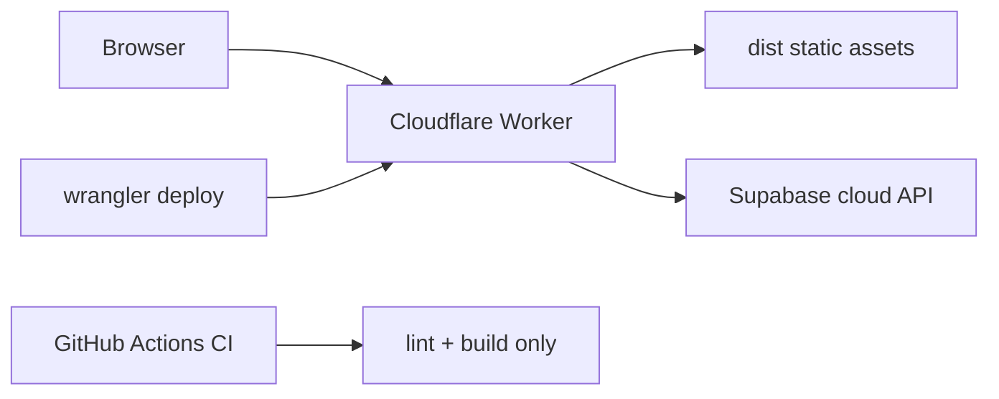

# First deploy plan — kids-time MVP

Approved deploy plan for the first production deployment to **Cloudflare Workers** (Astro 6 SSR via `@astrojs/cloudflare`). This repo uses a **Worker + static assets** layout in [`wrangler.jsonc`](../../wrangler.jsonc), not a standalone Pages-only project.

**Do not use** `wrangler pages deploy` for this stack. Use **`npx wrangler deploy`** after `npm run build`.

## Execution log (2026-05-20)

| Step | Status | Notes |
| ---- | ------ | ----- |
| Rename worker in `wrangler.jsonc` | Done | `kids-time-mvp` |
| Add `nodejs_compat_populate_process_env` | Done | Required for `astro:env` secrets on Workers |
| `npm ci` / `astro sync` / `lint` / `build` | Done | Node v24.15.0 via `.nvmrc` |
| `npx wrangler deploy` | Done | KV `SESSION` namespace auto-provisioned |
| `wrangler secret put` SUPABASE_* | Done | Values copied from local `.env` |
| Smoke test (HTTP) | **Blocked** | All tested routes return **500** — likely invalid or local-only `SUPABASE_URL` in `.env` (not reachable from edge) |

**Production URL:** https://kids-time-mvp.michal-machlowski.workers.dev

### Required human follow-up

1. Create or use a **hosted Supabase** project; copy real **Project URL** and **anon** key.
2. Re-upload secrets (do not use localhost URLs on the Worker):
   ```bash
   nvm use
   npx wrangler secret put SUPABASE_URL
   npx wrangler secret put SUPABASE_KEY
   ```
3. In Supabase → **Authentication → URL configuration**, add:
   - Site URL: `https://kids-time-mvp.michal-machlowski.workers.dev`
   - Redirect URLs: `https://kids-time-mvp.michal-machlowski.workers.dev/**`
4. Re-run smoke test (`/`, `/auth/signin`, `/dashboard` → redirect to sign-in).

## Architecture at deploy time



| Layer | Service | Role |
| ----- | ------- | ---- |
| HTTP / SSR | Cloudflare Worker (`@astrojs/cloudflare/entrypoints/server`) | Astro server routes, middleware, API |
| Static | `./dist` via `assets` binding in wrangler | CSS, JS, images from build |
| Auth / data | Supabase (external) | `SUPABASE_URL`, `SUPABASE_KEY` via `astro:env` |
| AI (later) | OpenRouter (external) | Not required for first deploy; add when AI routes ship |

## Prerequisites (manual — human gates)

Complete these before the first `wrangler deploy`:

1. **Cloudflare account** with Workers enabled.
2. **Wrangler auth** (interactive):
   ```bash
   npx wrangler login
   ```
   For CI later: create an API token with Workers deploy scope (out of scope for this first manual deploy).
3. **Hosted Supabase project** (production):
   - Dashboard → Settings → API → copy **Project URL** and **anon** key.
   - Configure **Authentication → URL configuration** with your Worker URL after first deploy (Site URL / redirect URLs).
   - Optional for local dev: keep `http://127.0.0.1:54321` in `.env` / `.dev.vars` only; **do not** point production Worker secrets at localhost.
4. **GitHub repository secrets** (for CI build on `master` / PRs — already consumed by [`.github/workflows/ci.yml`](../../.github/workflows/ci.yml)):
   - `SUPABASE_URL`
   - `SUPABASE_KEY`

## Secrets matrix

Use **identical variable names** everywhere (matches [`astro.config.mjs`](../../astro.config.mjs) `astro:env` schema):

| Name | Local dev | Cloudflare Worker | GitHub Actions |
| ---- | --------- | ----------------- | -------------- |
| `SUPABASE_URL` | `.env` and/or `.dev.vars` | `npx wrangler secret put SUPABASE_URL` | Repository secret |
| `SUPABASE_KEY` | `.env` and/or `.dev.vars` | `npx wrangler secret put SUPABASE_KEY` | Repository secret |

Rotation checklist: update Supabase keys → update GitHub secrets → `wrangler secret put` for both → redeploy → smoke-test auth.

**OpenRouter** (when AI routes exist): add `OPENROUTER_API_KEY` (or chosen name) to the same matrix; not blocking first deploy.

## Pre-deploy steps

### 1. Rename Worker (recommended)

In [`wrangler.jsonc`](../../wrangler.jsonc), change `name` from starter default to production name:

```jsonc
"name": "kids-time-mvp",
```

This avoids colliding with other `10x-astro-starter` deployments on the same account.

### 2. Local production build

From repo root with Node per [`.nvmrc`](../../.nvmrc) (v24.15.0 recommended):

```bash
npm ci
npm run build
```

Build must succeed with `SUPABASE_URL` and `SUPABASE_KEY` set (same values as production or valid placeholders if build only checks presence).

Optional gate (matches CI):

```bash
npx astro sync
npm run lint
```

### 3. Upload Cloudflare secrets

After `wrangler login`:

```bash
npx wrangler secret put SUPABASE_URL
npx wrangler secret put SUPABASE_KEY
```

## Deploy (agent or human after plan approval)

```bash
npm run build
npx wrangler deploy
```

Wrangler reads [`wrangler.jsonc`](../../wrangler.jsonc):

- `main`: `@astrojs/cloudflare/entrypoints/server`
- `compatibility_flags`: `["nodejs_compat"]`
- `assets.directory`: `./dist`

Note the **workers.dev** URL (or custom domain if configured) from CLI output.

## Post-deploy verification

| Check | Action |
| ----- | ------ |
| Home | Open `/` — no 5xx |
| Auth UI | `/auth/signin`, `/auth/signup` load |
| Protected route | `/dashboard` redirects unauthenticated users to sign-in |
| Runtime logs | `npx wrangler tail` while exercising sign-in |
| Supabase | Confirm auth redirect URLs include deployed origin |

## Rollback

```bash
npx wrangler rollback
```

Or redeploy a known-good git revision: `npm run build` then `npx wrangler deploy`.

**Caveat:** Supabase schema/auth changes are **not** reverted by Worker rollback.

## Follow-up (out of scope for first deploy)

Per [tech-stack.md](../foundation/tech-stack.md) (`ci_default_flow: auto-deploy-on-merge`):

- Add a GitHub Actions **deploy** job (after CI passes) using `CLOUDFLARE_API_TOKEN` + account ID, or connect **Cloudflare Workers Builds** to the repo.
- Branch **preview** deployments with per-environment Supabase secrets (avoid preview → prod DB).
- **OpenRouter** secrets and Worker CPU monitoring once AI suggestion routes run on the edge.

## Risks (from infrastructure decision)

| Risk | Likelihood | Impact | Mitigation |
| ---- | ---------- | ------ | ---------- |
| Worker CPU/time limits on future AI routes | M | H | Stream responses; short timeouts; paid Workers if needed |
| Node API incompatibility in dependencies | M | M | Keep `nodejs_compat`; avoid Node-only packages without `node:*` imports |
| Secrets mismatch local / CI / prod | M | H | Use secrets matrix above; smoke-test after any rotation |
| Supabase SSR cookie issues at edge | L | M | Follow `@supabase/ssr` patterns; test auth on deployed URL |
| Preview env pointing at prod Supabase | M | H | Separate Supabase project or strict env mapping for previews |

## References

- [infrastructure.md](../foundation/infrastructure.md) — platform recommendation and operational story
- [tech-stack.md](../foundation/tech-stack.md) — `deployment_target: cloudflare-pages`, GitHub Actions
- [README.md](../../README.md) — Supabase setup and deployment section

## Next step

- Fix **hosted Supabase** secrets and auth URLs (see Execution log), then verify routes return **200** / **302**.
- Optional: add GitHub Actions deploy job and set repository secrets to match production Supabase.
