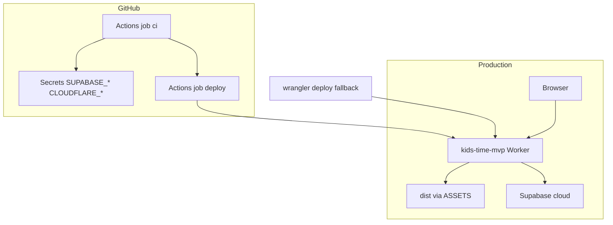

# Plan wdrożenia kids-time MVP (Cloudflare Workers)

Plan pierwszego wdrożenia produkcyjnego dla **Astro 6 SSR** z adapterem `@astrojs/cloudflare`, zgodny z [infrastructure.md](../foundation/infrastructure.md) i [tech-stack.md](../foundation/tech-stack.md).

**Komenda deploy:** `npx wrangler deploy` po `npm run build` — **nie** używaj `wrangler pages deploy`.

---

## Ocena poprzedniej wersji planu

| Obszar                               | Ocena       | Uwagi                                               |
| ------------------------------------ | ----------- | --------------------------------------------------- |
| Platforma / komenda deploy           | OK          | `npx wrangler deploy` — zgodne z infrastructure     |
| Worker + assets                      | OK          | `wrangler.jsonc`: `kids-time-mvp`, entrypoint Astro |
| Sekrety `SUPABASE_*`                 | OK          | Zgodne z `astro.config.mjs` (`astro:env`)           |
| CI lint/build                        | OK          | Workflow na `main`, Node 24 — job `deploy` po `ci`  |
| Supabase Auth URLs                   | Uzupełnione | Site URL, redirect URLs, szablon maila, PKCE        |
| Auth callback                        | Uzupełnione | `/auth/callback` + `emailRedirectTo` w signup       |
| `nodejs_compat_populate_process_env` | Uzupełnione | Wymagane dla sekretów `astro:env` na Workerze       |
| OpenRouter                           | Uzupełnione | F-02 — sekrety na Workerze (`wrangler secret put`)  |

**Wniosek:** Infrastruktura Workera jest wdrożona. Ten plan opisuje pełną ścieżkę produkcyjną: sekrety, Supabase Auth, weryfikacja E2E oraz follow-up CI/CD.

---

## Architektura



| Warstwa     | Technologia                                     | Źródło                                |
| ----------- | ----------------------------------------------- | ------------------------------------- |
| HTTP/SSR    | Cloudflare Worker + `@astrojs/cloudflare` ^13.5 | infrastructure, tech-stack            |
| Statyki     | `./dist` → binding `ASSETS`                     | wrangler.jsonc                        |
| Sesje Astro | KV `SESSION` (auto-provisioned przy deploy)     | pierwszy deploy Wrangler              |
| Auth/dane   | Supabase (hosted)                               | tech-stack `has_auth: true`           |
| AI          | OpenRouter (HTTP)                               | tech-stack `has_ai: true` — F-02 done |

---

## Stan wykonania

| Element                                                | Status                |
| ------------------------------------------------------ | --------------------- |
| Worker `kids-time-mvp` deployed                        | Done                  |
| `nodejs_compat` + `nodejs_compat_populate_process_env` | Done                  |
| Sekrety Supabase cloud na Worker                       | Done                  |
| Supabase Site URL + redirect URLs                      | Done                  |
| Szablon maila Confirm signup (TokenHash)               | Done                  |
| Auth PKCE callback w kodzie                            | Done                  |
| CI workflow na `main` w repo                           | Done                  |
| GitHub secrets + zielony CI                            | Done                  |
| Auto-deploy on merge                                   | Done                  |
| Preview branches                                       | Won't do — rezygnacja |

**Production URL:** https://kids-time-mvp.michal-machlowski.workers.dev

---

## Faza 0 — Wymagania wstępne (bramki człowieka)

- [x] Konto Cloudflare + `npx wrangler login` (lub token API pod CI)
- [x] Projekt Supabase **cloud** — URL: `https://<ref>.supabase.co` (bez `/rest/v1/`), klucz **anon**
- [x] GitHub [`ghMichal/kids-time`](https://github.com/ghMichal/kids-time) — sekrety `SUPABASE_URL`, `SUPABASE_KEY`, `CLOUDFLARE_API_TOKEN`, `CLOUDFLARE_ACCOUNT_ID`
- [x] Lokalnie: Node **24** (`.nvmrc`), `.env` + `.dev.vars` z `.env.example`

---

## Faza 1 — Build i deploy Worker

Zawsze **Node 24**:

```bash
nvm use
npm ci
npx astro sync
npm run lint
npm run build
npx wrangler deploy
```

**Konfiguracja** ([wrangler.jsonc](../../wrangler.jsonc)):

- `name`: `kids-time-mvp`
- `main`: `@astrojs/cloudflare/entrypoints/server`
- `compatibility_flags`: `nodejs_compat`, `nodejs_compat_populate_process_env`
- Wrangler deployuje z wygenerowanego `dist/server/wrangler.json`

**Sekrety Cloudflare:**

```bash
npx wrangler secret put SUPABASE_URL
npx wrangler secret put SUPABASE_KEY
```

Weryfikacja: `npx wrangler secret list`

**Po deployu:** zapisz URL `*.workers.dev` i `version_id` (rollback).

---

## Faza 2 — Supabase Auth

Dashboard: **Authentication → URL configuration**

| Pole              | Wartość                                                             |
| ----------------- | ------------------------------------------------------------------- |
| **Site URL**      | `https://kids-time-mvp.michal-machlowski.workers.dev`               |
| **Redirect URLs** | `https://kids-time-mvp.michal-machlowski.workers.dev/**`            |
|                   | `https://kids-time-mvp.michal-machlowski.workers.dev/auth/callback` |
|                   | `http://localhost:4321/**`                                          |

**Szablon Confirm signup** (zalecany dla SSR/PKCE):

```html
<h2>Confirm your email address</h2>
<p>
  <a href="{{ .SiteURL }}/auth/callback?token_hash={{ .TokenHash }}&type=signup"> Confirm email address </a>
</p>
```

Alternatywa: `{{ .ConfirmationURL }}` — działa po poprawnym Site URL; callback obsługuje też `?code=` (PKCE).

Aplikacja: [`signup.ts`](../../src/pages/api/auth/signup.ts) ustawia `emailRedirectTo: {origin}/auth/callback`.

**Uwagi:**

- Limit wysyłki maili Supabase — unikaj wielokrotnej rejestracji testowej
- **Nie** używaj `localhost` w sekretach Workera
- Przy duplikacie e-mail: resend w API lub dashboard → Users

---

## Faza 3 — Weryfikacja po wdrożeniu

| #   | Test                                  | Oczekiwany wynik                                              |
| --- | ------------------------------------- | ------------------------------------------------------------- |
| 1   | `GET /`                               | HTTP 200                                                      |
| 2   | `GET /auth/signin`, `/auth/signup`    | HTTP 200                                                      |
| 3   | `GET /dashboard` bez sesji            | HTTP 302 → `/auth/signin`                                     |
| 4   | Rejestracja → mail → `/auth/callback` | Redirect `/dashboard` lub `/auth/signin?info=...` + logowanie |
| 5   | Logowanie hasłem                      | Sukces, sesja w cookies                                       |
| 6   | `npx wrangler tail`                   | Brak 5xx podczas auth                                         |

**CI:** push na `main` → job `ci` zielony, potem job `deploy` + smoke `GET /` (sekrety GitHub).

---

## Faza 4 — Follow-up (tech-stack: auto-deploy-on-merge)

Poza pierwszym deployem:

1. **Zrobione** — job `deploy` w [`.github/workflows/ci.yml`](../../.github/workflows/ci.yml) po zielonym `ci` na `push` do `main` (`CLOUDFLARE_API_TOKEN`, `CLOUDFLARE_ACCOUNT_ID`). Smoke: `GET /` na URL produkcji. **Nie** Workers Builds i **nie** `wrangler pages deploy`.
2. **Rezygnacja** — preview branches z osobnym Supabase nie wchodzą do MVP. PR-y zostają przy jobie `ci` (lint + test + build), bez deployu.
3. **Zrobione** — `OPENROUTER_API_KEY` + `OPENROUTER_MODEL` w Worker (`wrangler secret put`) — wymagane od F-02 (`POST /api/ai/suggestions`).

---

## Macierz sekretów

| Zmienna                 | `.env` / `.dev.vars` | Worker     | GitHub Actions |
| ----------------------- | -------------------- | ---------- | -------------- |
| `SUPABASE_URL`          | dev / cloud          | prod cloud | build CI       |
| `SUPABASE_KEY`          | anon                 | anon       | build CI       |
| `OPENROUTER_API_KEY`    | dev key              | prod key   | —              |
| `OPENROUTER_MODEL`      | `openai/gpt-4o-mini` | prod value | —              |
| `CLOUDFLARE_API_TOKEN`  | —                    | —          | deploy         |
| `CLOUDFLARE_ACCOUNT_ID` | —                    | —          | deploy         |

**Rotacja:** Supabase → GitHub secrets → `wrangler secret put` → opcjonalnie redeploy → smoke test auth.

---

## Rollback

```bash
npx wrangler rollback
```

Lub: znany commit → `npm run build` → `npx wrangler deploy`.

Pad smoke (`GET /` ≠ 200) oblewa job `deploy` i **nie** uruchamia automatycznego rollbacku — rollback zostaje ręczny.

Migracje Supabase **nie** cofają się z rollbackiem Workera.

---

## Rejestr ryzyk

| Ryzyko                          | L   | I   | Mitigacja                         |
| ------------------------------- | --- | --- | --------------------------------- |
| CPU Workera przy OpenRouter     | M   | H   | Streaming, timeouts, paid Workers |
| Rozjazd sekretów local/CI/prod  | M   | H   | Macierz + checklist po rotacji    |
| PKCE / Site URL / szablon maila | M   | M   | Faza 2                            |
| Preview → prod Supabase         | L   | H   | Zmitigowane — brak preview w MVP  |
| Brak auto-deploy                | L   | M   | Zmitigowane — job `deploy` w CI   |

Źródło: [infrastructure.md](../foundation/infrastructure.md) — rejestr ryzyk i anti-bias cross-check.

---

## Referencje

- [infrastructure.md](../foundation/infrastructure.md)
- [tech-stack.md](../foundation/tech-stack.md)
- [README.md](../../README.md)
- [Astro Cloudflare adapter](https://docs.astro.build/en/guides/integrations-guide/cloudflare/)
